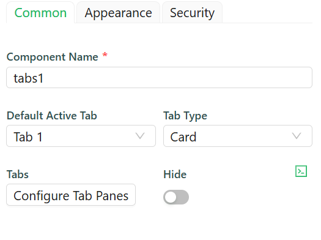
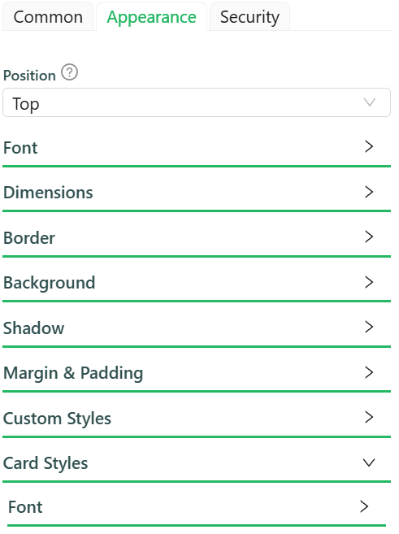
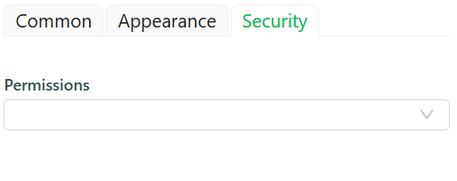

# Tabs

Tabs are used to organize content into separate sections or panes, where users can switch between these sections by clicking on the tabs. Each tab represents a different section, and only one section is visible at a time.

[//]: # '<iframe width="100%" height="500" src="https://pd-docs-adminportal-test.shesha.dev/shesha/forms-designer/?id=41d541dc-75c9-4436-ad41-3b39ea828efb" title="Tabs Component" ></iframe>'

## **Properties**

The following properties are available to configure the behavior of the component from the form editor (this is in addition to [common properties](/docs/front-end-basics/form-components/common-component-properties)).

### Common

#### **Component Name**

Gives your Tabs component an identity. This name helps distinguish it from its peers on the form.

#### **Default Active Tab**

Choose which tab should greet your users first. This dropdown lets you set the initial active tab based on tab configurations.

#### **Tab Type**

Defines the visual style of your tabs.

- **Card**: Each tab looks like a clickable card.

- **Line**: Sleek underline style for the minimalists.

#### **Tabs**

#### Configure Tab Panes
 The user can use the configure tabs option to add the tabs that they want to have.
 

#### **Hide**

Control the visibility of the Tabs component entirely.

### Appearance

 

#### **Position**

Set where your tabs appear:

- Top
- Bottom
- Left
- Right

#### **Font**

Customize how your tab labels look. Choose the font family, size, weight, and color.

#### **Dimensions**

Specify the size of your component:
- Width, Height
- Min/Max Width and Height
- Overflow behavior

#### **Border**

Personalize the borders:
- Set border width, color, and style
- Round the corners for a softer touch

#### **Background**

Pick your flavor of background:

- Color
- Gradient
- Image URL
- Uploaded Image
- Stored File

Also tweak background size, position, and repeat behavior.

#### **Shadow**

Give depth with adjustable shadows:

- Offset, Blur, Spread, Color

#### **Margin & Padding**

Fine-tune spacing inside and around the component.

####  **Custom Styles**

Inject your own CSS styles via JavaScript (must return a style object).

#### **Card Styles**

For when using Card tab type:

- Font styles specific to card content
- Dimensions (width, height, min/max)
- Background types and image settings
- Custom styles just for the card view

### Security

 

#### **Permissions**

Define who can see or interact with this component. 

