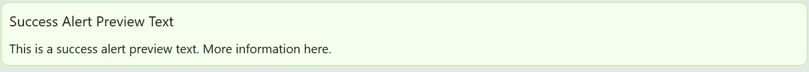
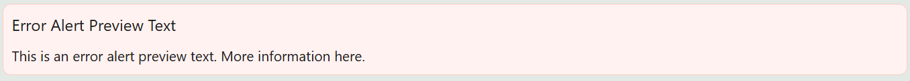

# Alert

This component is used when you need to show alert messages to users. It is also useful when you need a persistent static container that is closable by user actions.

[//]: # (<iframe width="100%" height="500" src="https://pd-docs-adminportal-test.shesha.dev/shesha/forms-designer/?id=793ec3d1-04c1-4253-adec-6521f82be88b" title="Alert Component" ></iframe>)

## Properties

The following properties are available to configure the behavior of the component from the form editor (this is in addition to [common properties](/docs/front-end-basics/form-components/common-component-properties)).

### Common

#### **Property Name** ``string``

Unique identifier used to bind the component's value to your data model.

#### **Type** ``object`` 

Choose the type of alert to display:

- **Success**: Positive confirmation messages.

- **Info** *(default)*: General information.

- **Warning**: Important alerts that require caution.

- **Error**: Critical issues or errors that need immediate attention.

#### **Message** ``string``

Main text content that appears inside the alert. Supports expressions and variables.

#### **Description** ``string``

 Additional description for alert message. You can include dynamic values in your description by tapping into your data object using 'mustache templating'. E.g. `{{name}}`

#### **Show Icon** ``boolean``
Toggle whether an icon appears next to the message.

#### **Hide** ``boolean``

Set whether the alert should be visible or hidden.

#### **Closable** ``boolean``

Allow users to close (dismiss) the alert manually.

#### **Marquee** ``boolean``

Enable scrolling text for dynamic visual emphasis.

#### **Banner** ``boolean``

Render the alert as a full-width banner at the top of the form or page.

___

### Appearance

####  **Custom Styles** ``function``

Inject your own CSS styles via JavaScript (must return a style object).