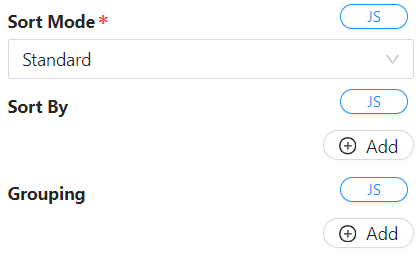

# DataTable Context

A datatable context component is a powerful tool that allows users to manage and manipulate tabular data within an application. It's often used in scenarios where you need to display, organize, and interact with data in a structured, table-like format. Below are the key functionalities:

**Data Display**

    The datatable context component primarily serves to display data in a table format. It could be information retrieved from a database, an API, or entered directly by users.

**Customization**

 Users can typically customize the appearance and behavior of the table. This may involve setting column headers, defining data types for each column, adjusting the table's styling, and configuring how the data is presented.

**Data Interaction**

  This component allows users to interact with the data. Common functionalities include sorting columns, filtering data based on specific criteria, and searching within the table. Users might also be able to edit, delete, or add new data directly from the table interface.

**Data Source Binding**

  The datatable context component is often connected to a data source, which could be a database, an API, or an internal data structure within the application. This binding enables the table to dynamically reflect changes in the underlying data.

**Contextual Actions**

  Some platforms allow for contextual actions within the datatable. For example, clicking on a specific row might trigger an action, like displaying more details about that particular entry, opening a related form for editing, or initiating a specific workflow related to the selected data.

**Integration with Other Components**

  This component often integrates with other elements or functionalities within the application. For instance, the data displayed in the table might be linked to forms, charts, or other components for a more comprehensive user experience.

The "context" in a datatable context component typically refers to the ability to manage and manipulate the context or environment in which the table operates. This might include setting rules, managing data relationships, and configuring how the table interacts with the rest of the application.

Overall, the datatable context component provides an intuitive and efficient way to manage and display structured data within an application. It streamlines the process of presenting, interacting with, and managing tabular data, offering a user-friendly interface for data manipulation.

## Properties

The following properties are available to configure the behavior of the component from the form editor (this is in addition to [common properties](/docs/front-end-basics/form-components/common-component-properties).

- **Source Type:**
  - Options: Entity, Form, URL

### Entity

- **Entity Type:**
  - This provides a dropdown of all the entities available in the application that the component can use as a data source.
  - By default, the GET URL that is used is `/api/services/app/Entities/GetALL`. This will do a default ‘GET ALL’ of the entity that you have selected.
- **Custom Endpoint:**
  - This allows you to override the default ‘GET ALL’ URL provided when you selected the entity to be binded to the context. You can override that by providing the GET ALL URL.

### URL

- **Custom Endpoint:**

  - This allows you to provide a ‘GET ALL’ URL to bind to the table as a datasource if you do not want to bind the context to an entity but to a custom endpoint.

### Data Fetching Mode

- Options:
  - **Paging:**
    - Paging is a technique used to manage large datasets by breaking them into smaller, manageable chunks or pages.
    - Default Page Size specifies how much fetched data should be displayed per request.
  - **Fetch All:**
    - Fetch all involves retrieving the entire dataset in one go.

### Sort Mode



- Options:
  - **Standard:**
    - In standard mode, users can sort the table data by clicking on column headers or by specifying one or more sorting properties and the sorting order.
    - 'Allow sorting' option enables users to sort the table by clicking on the column header.
  - **Strict:**
    - Strict mode allows users to specify one or more properties for ordering the table data.

It is also important to note that this property, as well as the other properties accomodate for `Javascript` expression scripting to allow for dynamic setting of property values. An example of Javacript expression script to dynamically sort a table would look like this:

```javascript
return [{ propertyName: "gender", sorting: "asc" }];
```


### Grouping

- The grouping feature allows users to group table data by specifying one or more properties and the desired sort mode for each grouping. If one or more grouping rows are specified, these properties will always appear first in the sort by clause prior to any other manually ordered columns.

It is also important to note that this property, as well as the other properties accomodate for `Javascript` expression scripting to allow for dynamic setting of property values. An example of Javacript expression script to dynamically group a table would look like this:

```javascript
return [
  { propertyName: "price", sorting: "asc" },
  { propertyName: "name", sorting: "asc" },
];
```

## Properties

### How to Access

Information about the `Datatable Context` can be accessed within the `Contexts` that are available in the application and can be accessed like this (_assuming that the [datatable context](/docs/front-end-basics/form-components/data-display/data-table/datatable-context) component has a [property name](/docs/front-end-basics/form-components/common-component-properties#property-name) of `indexTable`_ ):

```javascript
contexts.indexTable;
```

### SelectedRow

In the context of a datatable, a `SelectedRow` object typically refers to the representation of a row that has been selected by the user. `Datatables` are commonly used in web applications to display tabular data, and allowing users to select one or more rows can be an essential feature for various interactions.

Here are some key points related to the concept of a `SelectedRow` object in the context of a datatable:

- **User Interaction**:
  Users interact with datatables by clicking on rows to select them. The `SelectedRow` object captures the information about the row that the user has selected.

- **Data Representation**:
  The `SelectedRow` object is a way to represent the data of the selected row. It may include the values of each column in the selected row or a reference to the underlying data associated with that row.

- **State Management**:
  Datatables often involve managing the state of the user interface. The `SelectedRow` object is part of the state that tracks which row or rows are currently selected. This information is crucial for performing actions such as editing, deleting, or processing the selected data.

#### How to Access

```javascript
contexts.indexTable.selectedRow;
```

#### Example


In the example above, where the `datatable context` component has a property name of `indexTable`, the current state of the `index table`, which can be accessed through `contexts.indexTable`, would be:

```json
{
  "selectedRow": {
    "index": 1,
    "row": {
      "id": "d3c4c78f-c805-41c2-b4ba-cbb5a7663c0a",
      "title": 1,
      "firstName": "John",
      "lastName": "Doe",
      "dateOfBirth": "1995-01-07T00:00:00",
      "mobileNumber1": "0123456789",
      "emailAddress1": "johnd@shesha.io",
      "gender": 1,
      "membershipNumber": "0001",
      "membershipStartDate": "2023-11-30T00:00:00",
      "membershipEndDate": "2023-12-09T00:00:00",
      "membershipStatus": 2
    },
    "id": "d3c4c78f-c805-41c2-b4ba-cbb5a7663c0a"
  },
  "selectedIds": [],
  "currentPage": 1,
  "tableData": [
    {
      "id": "ffc1f0c9-5b9d-4a04-aed2-0d4cfe1152a9",
      "title": 2,
      "firstName": "Jane",
      "lastName": "Doe",
      "dateOfBirth": "1993-02-03T00:00:00",
      "mobileNumber1": "0123456788",
      "emailAddress1": "janed@shesha.io",
      "gender": 2,
      "membershipNumber": "0002",
      "membershipStartDate": "2023-12-04T00:00:00",
      "membershipEndDate": "2024-12-04T00:00:00",
      "membershipStatus": 2
    },
    {
      "id": "d3c4c78f-c805-41c2-b4ba-cbb5a7663c0a",
      "title": 1,
      "firstName": "John",
      "lastName": "Doe",
      "dateOfBirth": "1995-01-07T00:00:00",
      "mobileNumber1": "0123456789",
      "emailAddress1": "johnd@shesha.io",
      "gender": 1,
      "membershipNumber": "0001",
      "membershipStartDate": "2023-11-30T00:00:00",
      "membershipEndDate": "2023-12-09T00:00:00",
      "membershipStatus": 2
    }
  ],
  "userSorting": [],
  "grouping": [],
  "api": {}
}
```

### Table Data

This includes a list of the different table rows indicated as objects. _See above example_.

#### How to Access

```javascript
contexts.indexTable.tableData;
```

### APIs

This includes an exhaustive list of API functions that can be applied to the table.

#### How to Access

```javascript
contexts.indexTable.api;
```

### SelectedIDs

This includes a list of the selected IDs from the table data. This is utilized in the cases where the [selection mode](/docs/front-end-basics/form-components/data-display/data-table/datalist#selection-mode) of a [datalist](/docs/front-end-basics/form-components/data-display/data-table/datalist) or [datatable](/docs/front-end-basics/form-components/data-display/data-table/datatable) is set to `Multiple`.

#### How to Access

```javascript
contexts.indexTable.selectedIds;
```
