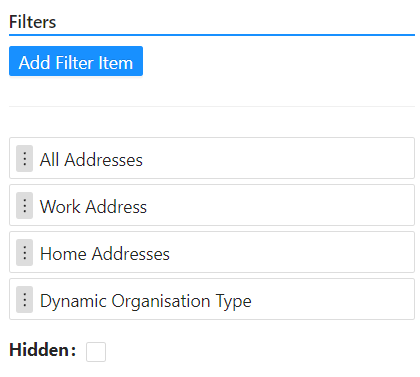

# Table View Selector

> _**NOTE** This component should be used within a [Datatable Context Component](/docs/front-end-basics/form-components/data-display/data-table/datatable-context.md)_.

A **Table View Selector** is a user interface component commonly found in applications, particularly those dealing with tabular or list-based data. It allows users to switch between different predefined views or filters of the data presented in a table format. This component provides a list of configurable query builders that can be used to configure the different predefined filters and views.

It is also important to note that this component takes in dynamic values from your form data or your context, which is helpful in instances where you want to create a view based on the current state of the form.

There is also a ‘Hidden’ toggle in the cases where you do not want the filter to be visible in the UI. The table view selector can also act as a title, in cases where you do not need to filter your table view.

_Implementation can be found [here](/docs/front-end-basics/how-to-guides/filtering)._
