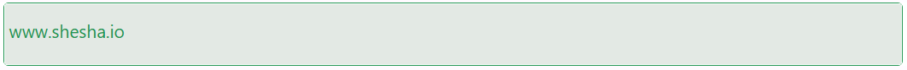

# Link

The Link component is a versatile way to navigate users either within your application or to external destinations. It can be styled richly and supports dynamic content, child elements, and target behavior customization.

## Properties

The following properties are available to configure the behavior of the component from the form editor (this is in addition to [common properties](/docs/front-end-basics/form-components/common-component-properties)).

### Common

#### **Property Name** ``string``

Unique identifier used to bind the component's value to your data model.

#### **Label** ``object``

Customize whether to display a label. Hiding it can simplify the UI in some layouts.

#### **Content** ``string``

The text or content that will be displayed inside the link.

#### **Href** ``string``

The URL or path the link points to.

#### **Has Children** ``boolean``

If enabled, allows the link to have child elements nested inside it.

#### **Hide** ``boolean``

Set whether the link should be visible or hidden.

#### **Target** ``object``

Specifies where to open the linked document:

- **Blank**: Opens in a new tab.

- **Parent**: Opens in the parent frame.

- **Self** *(default)*: Opens in the same frame.

- **Top**: Opens in the topmost frame.

___

### Appearance

#### **Font** ``object`` 

Customize how your tab labels look. Choose the font family, size, weight, and color.

####  **Custom Styles** ``function``

Inject your own CSS styles via JavaScript (must return a style object).

