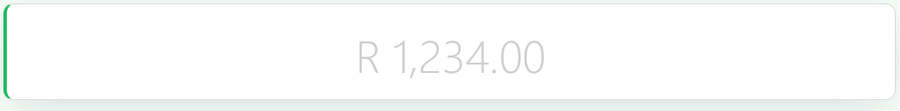

# Statistic

The Statistic component is perfect for displaying key numerical indicators such as totals, metrics, or performance indicators. With customizable title and value styling, optional prefix/suffix elements, and click handling.

[//]: # '<iframe width="100%" height="500" src="https://pd-docs-adminportal-test.shesha.dev/shesha/forms-designer/?id=5e5a3a67-c837-43c3-a34d-829a83465b49" title="Statistic Component" ></iframe>'

## Properties

The following properties are available to configure the behavior of the component from the form editor (this is in addition to [common properties](/docs/front-end-basics/form-components/common-component-properties)).

### Common

#### **Property Name** `string`  
Binds the statistic value to a data field. *(Required)*

#### **Title** `string`  
The title or label of the statistic. Can be dynamic.

#### **Placeholder** `string`  
Text shown when no value is available.

#### **Value** `number`  
Numeric value to display if no property binding is provided.

#### **Precision** `number`  
Decimal places to show. *(Min: 0)*

#### **Prefix** `string`  
Text shown before the value.

**Prefix Icon** `object`  
Icon displayed before the value.

**Suffix** `string`  
Text shown after the value.

**Suffix Icon** `object`  
Icon displayed after the value.

___

### Appearance

#### Title Font
Customize how the title appears with the following options:
- **Family**: Choose from system or web-safe fonts.
- **Size**: Set the font size using CSS units.
- **Weight**: Adjust font thickness (light, normal, bold, etc.).
- **Color**: Pick the font color.
- **Align**: Set horizontal alignment (left, center, right).

#### Value Font
Control the look of the displayed value with the following options:
- **Family**: Choose from system or web-safe fonts.
- **Size**: Set the font size using CSS units.
- **Weight**: Adjust font thickness (light, normal, bold, etc.).
- **Color**: Pick the font color.
- **Align**: Set horizontal alignment (left, center, right).\

#### Dimensions `string`
Set width, min/max width constraints using any CSS units.

#### Border `object`
Configure border style, width, radius, and color.

#### **Background** ``object``

Pick your flavor of background:

- Color
- Gradient
- Image URL
- Uploaded Image
- Stored File

#### Shadow `object`
Apply a shadow with offset, blur, spread, and color settings.

#### Margin & Padding `object`
Fine-tune spacing around and inside the component.

#### Custom Style `function`
Inject your own CSS styles via JavaScript (must return a style object).

