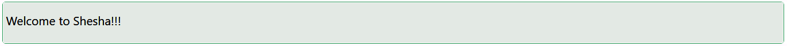

# Text

This refers to a UI element or module that is responsible for displaying text content on a webpage. Text components can vary in complexity and functionality, and they are a fundamental part of building user interfaces.

[//]: # '<iframe width="100%" height="500" src="https://pd-docs-adminportal-test.shesha.dev/shesha/forms-designer/?id=5e5a3a67-c837-43c3-a34d-829a83465b49" title="Text Component" ></iframe>'

## Properties

The following properties are available to configure the behavior of the component from the form editor (this is in addition to [common properties](/docs/front-end-basics/form-components/common-component-properties)).

### Common

#### Property Name `string`

Unique identifier binding the text component to the form or data model.

#### Type `string`

Select the HTML element type:
- **Span** *(default)*: Inline text.
- **Paragraph**: Paragraph block.
- **Title**: Heading style.

#### Content Display `object`

Controls the text source:
- **Content** *(default)*: Manual text.
- **Property Name**: Dynamically fetch text from the property.

#### Data Type `object`

Specify the data format:
- **String** *(default)*
- **Date Time**
- **Number**
- **Boolean**

#### Hide `boolean`

Control whether the text component is visible.

#### Content `string`

The static text content to display.

#### Hide `boolean`
Control whether the text component is visible.

#### Italic `boolean`

Renders the text in italics if enabled.

#### Code `boolean`

Styles the text to look like code, using a monospace font.

#### Strikethrough `boolean`

Applies a line through the text for a strikethrough effect.

#### Underline `boolean`

Adds an underline to the text for emphasis.

#### Ellipsis `boolean`

Truncate overflowing text with an ellipsis (`...`).

#### Mark `boolean`

Highlights the text with a background color (like a marker).

#### Keyboard `boolean`

Styles the text to represent keyboard input (e.g., `<kbd>` styling).

#### Copyable `boolean`

Allows users to easily copy the text by clicking an icon or button.

___

### Appearance

#### Content Type `object`

Defines the tone or theme of the text:
- **Default** *(default)*
- **Primary**
- **Secondary**
- **Success**
- **Warning**
- **Info**
- **Error**
- **Custom Color**

#### **Dimensions** ``object`` 

Specify the size of your component:
- Width, Height
- Min/Max Width and Height
- Overflow behavior

#### **Border** ``object`` 

Personalize the borders:
- Set border width, color, and style
- Round the corners for a softer touch

#### **Background** ``object``

Pick your flavor of background:

- Color
- Gradient
- Image URL
- Uploaded Image
- Stored File

Also tweak background size, position, and repeat behavior.

#### **Shadow** ``object`` 

Give depth with adjustable shadows:

- Offset, Blur, Spread, Color

#### **Margin & Padding** ``object``

Fine-tune spacing inside and around the component.

####  **Custom Styles** ``function``

Inject your own CSS styles via JavaScript (must return a style object).