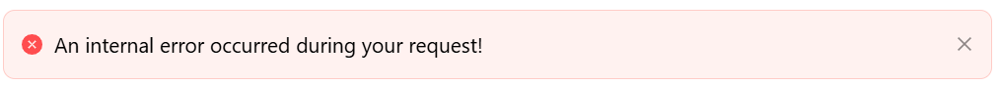

# Validation Errors
The Validation Errors component displays validation messages triggered by user input or programmatic checks. It helps guide users by surfacing required fields, invalid entries, or custom business logic warnings in a centralized and styled display.

## Properties

The following properties are available to configure the behavior of the component from the form editor (this is in addition to [common properties](/docs/front-end-basics/form-components/common-component-properties)).

### Common

#### **Component Name** `string`  
A unique identifier used to reference this validation block within the form.

#### **Hide** `boolean`  
Controls the visibility of the component using conditional logic.