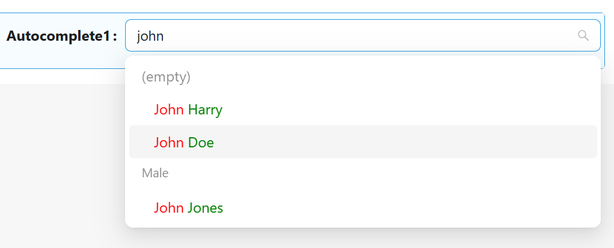

# Autocomplete

Autocomplete is used when you need an input box instead of a selector. It is an input box with text hints, and users can type freely. The keyword is aiding input.

## Properties

The following properties are available to configure the behavior of the component from the form editor (this is in addition to [common properties](/docs/front-end-basics/form-components/common-component-properties).

### Selection Mode

Set mode of selection. Options: `Single` (Single value), `Multiple` (Array of values)

### Disable search

The component will work as a simple Dorpdown

### Data Source Type

Where the component should source the data to be displayed as options. Options: `Entities List`, `URL`

### Entity Type

Drop down of all the entities available in the systems to bind to the component as options

### Entity Filter

The JavaScript Query Builder is a rich and responsive UI for filtering large amounts of data by creating or editing conditions. It outputs structured JSON filters that can be easily parsed to create SQL queries. It allows you to create conditions and group them using AND/OR logic. This was explained in an earlier section. Implementation can be found [here](/docs/front-end-basics/how-to-guides/filtering).

### Custom Source Url

Custom URL for getting data from a non-standard source

### Value format

Format of field value

`Simple Id` - field value contains only simple Id, eg `autocomplete1 : "7eaeebdb-e6df-4ed9-ae29-af0f833e1169"`

`Entity reference` - field value contains object with additional Entity Reference data, eg `autocomplete1 : { "id" : "7eaeebdb-e6df-4ed9-ae29-af0f833e1169", _className : "Shesha.Domain.Person", _displayName : "John Doe" }`. Available only for `Entities List` **Data Source Type**.

`Custom` - formats of field value and formats of options can be configured by scripts (`Key value Function`, `Value Function`, `Display value Function`)

### Display Property

Name of the property that should be displayed in the autocomplete. Live empty to use default display property defined on the back-end.

### Display value Function

A script to get the displayed name of the elements. It can be used for custom display of options.

### Key Property Name

Name of the property that should be used as a key. Live empty to use default key property (usually `id`)

### Fields to fetch

Allows to specify entty properties that should be received from the backend.

To use `firstName` and `lastName` from the previous example need to get these properties from the backend

### Sort By

Adds additional information to the request about sorting the data on the backend side before sending it.

### Grouping

Allows to group options in the Autocopmlete list

### Use Quickview

- Entity display name displays the specified form in a Quickview on hover. This functionality is only possible on a details view (readonly). This is very useful in cases where the user would like to view more information about the linked entity in the form of a pop-up, however have the functionality to edit and change the value of the linked entity when on edit mode

  #### Form Path

  - This brings a dropdown list of all the forms that are available in the system and can be rendered as a quickview

  #### Get Entity Url

  - This is used in cases where you want to override the default ‘GET’ URL that is being utilized when the Entity Type has been selected.

  #### Display Property Name

  - Name of the property that should be displayed in the field. Leave empty to use the default display property defined in the backend

  #### Width

  - The display width of the quickview on hover
