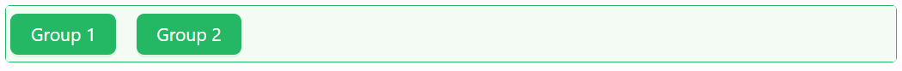
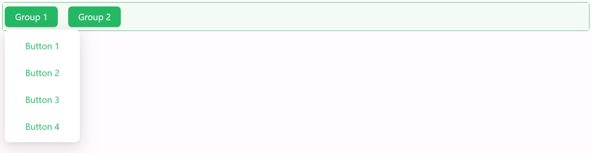
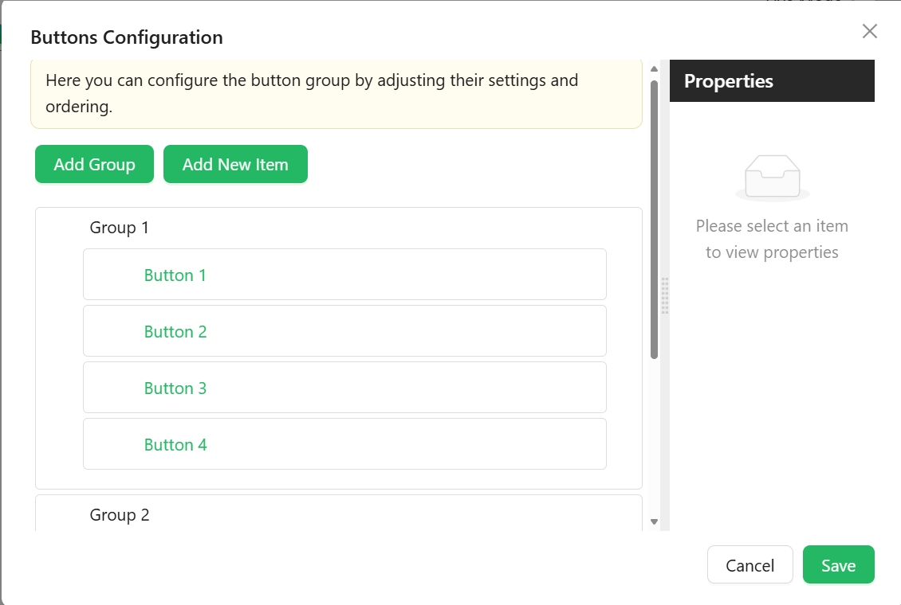

# Button Group

The Button Group component offers a flexible way to present a set of action buttons in a single row or column layout. With options for layout orientation, spacing, and complete styling control, it’s ideal for organizing grouped actions in a visually consistent manner.

[//]: # '<iframe width="100%" height="500" src="https://pd-docs-adminportal-test.shesha.dev/shesha/forms-designer/?id=4d5f3201-2ba4-4a19-b3de-08153124ea65" title="button group Component" ></iframe>'

## Properties

The following properties are available to configure the behavior of the component from the form editor (this is in addition to [common properties](/docs/front-end-basics/form-components/common-component-properties)).

### Common
#### **Component Name** `string`  
A unique identifier for the button group. *(Required)*

#### **Edit Mode**  ``object``

Set the component’s interaction behavior:

- **Inherited *(default)***: Behavior is inherited from the parent form.

- **Editable**: Users can set and change their button.

- **Read Only**: Users can view the button group but cannot change it.

#### **Hide** `boolean`  
Controls whether the button group is shown or hidden.

#### **Configure Button Group** `object`  

Configure button groups and items using a visual builder. Optionally supports expression logic for visibility or customization.
This array may include two kinds of entries: **Group Items** and **Button Items**, each with its own configuration.

**Group Item**

Used to group multiple buttons under a common label or logic.
- **Group Name** ``string`` – Internal identifier for the group.
- **Label** ``string`` – The title for the button group.
- **Group Tooltip** ``string`` – Tooltip displayed when hovering over the group.
- **Icon** ``object`` – Optional icon for the group label.
- **Down Icon** ``object`` – Optional dropdown icon to indicate collapsibility.
- **Button Type** ``object`` – Button style type for the group:
    - Link *(default)*
    - Primary 
    - Ghost
    - Dashed
    - Text

- **Edit Mode** ``object`` – Controls interaction within the group:
    - Editable
    - Read Only
    - Inherited *(default)*

- **Hide** ``boolean`` – Hides the entire group.

- **Hide When Empty** ``boolean`` – Automatically hides the group if no visible buttons remain.

**Button Item**

Used to define individual buttons.
- **Item Type** ``string`` – Defines the button's behavior:
    - Button *(default)*
    - Separator
    - Dynamic Items

- **Name** ``string`` – Internal identifier for the button.
- **Caption** ``string`` – Label or descriptive text shown on the button.
- **Tooltip** ``string`` – Helper text displayed on hover.
- **Icon** ``string`` – Optional icon shown beside the caption.
- **Edit Mode** ``object`` – Controls interaction for the button.
    - Editable
    - Read Only
    - Inherited *(default)*

- **Hide** ``boolean`` – Determines whether the button is hidden.

#### **Is Button Inline** `boolean`  
Displays buttons as inline-flex elements to keep them aligned in a single line.

___

### Appearance

#### **Gap** `object`  
Spacing between buttons:
- Small
- Medium
- Large

#### **Dimensions** ``object`` 

Specify the size of your component:
- Width, Height
- Min/Max Width and Height
- Overflow behavior

#### **Border** ``object`` 

Personalize the borders:
- Set border width, color, and style
- Round the corners for a softer touch

#### **Background** ``object``

Pick your flavor of background:

- Color
- Gradient
- Image URL
- Uploaded Image
- Stored File

Also tweak background size, position, and repeat behavior.

#### **Shadow** ``object`` 

Give depth with adjustable shadows:

- Offset, Blur, Spread, Color

#### **Margin & Padding** ``object``

Fine-tune spacing inside and around the component.

####  **Custom Styles** ``function``

Inject your own CSS styles via JavaScript (must return a style object).
