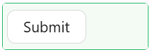

# Button

The Button component adds a clickable button to your form. Buttons trigger actions - submitting the form, resetting fields, opening a dialog, navigating to another page, or running a custom script. Every button has a label, an optional icon, and an Action Configuration that controls exactly what happens when the user clicks it.



---

## Properties

The following properties are available to configure the Button component from the form designer. These are in addition to the [common properties](/docs/front-end-basics/form-components/common-component-properties) shared by all Shesha components.

---

### Display

#### **Label** `string`

The text displayed on the button. Keep this short and action-oriented, for example `Save`, `Cancel`, or `Submit Application`.

---

#### **Tooltip** `string`

A short message that appears when the user hovers over the button. Use this to explain what the button does when the label alone is not enough.

---

#### **Icon** `string`

An optional icon displayed alongside the label. Select an icon from the icon picker in the designer.

---

#### **Icon Position** `object`

Controls where the icon appears relative to the label.

| Option | Description |
|---|---|
| `start` | Icon appears to the left of the label. |
| `end` | Icon appears to the right of the label. |

---

#### **Button Type** `object`

Controls the visual style of the button. Choose a type that matches the button's importance and role in your form layout.

| Option | When to use |
|---|---|
| `primary` | A filled, high-contrast button. Use for the main action on the form, typically the submit or save button. |
| `default` | A standard outlined button. Use for secondary actions that are available but not the primary focus. |
| `dashed` | An outlined button with a dashed border. Use for optional or additive actions, such as adding a new item. |
| `link` | Renders the button as a plain hyperlink. Use when the action should feel like a navigation link rather than a button. |
| `text` | Renders the button with no border or background. Use for low-priority actions in tight layouts. |
| `ghost` | A transparent button with a visible border and text. Use on coloured or image backgrounds where a filled button would clash. |

:::tip
Use `primary` for one button per form - the main action the user is expected to take. Use `default` or `text` for secondary actions like Cancel or Reset, so the primary action stands out clearly.
:::

---

#### **Danger** `boolean`

When enabled, the button renders with a red colour scheme to indicate a destructive or irreversible action. Use this on buttons that delete records or perform actions that cannot be undone.

---

#### **Block** `boolean`

When enabled, the button expands to fill the full width of its container instead of sizing to fit its label. Use this when you want a full-width button, for example at the bottom of a form section.

---

#### **Action Configuration** `object`

Defines what happens when the user clicks the button. You configure it through the action builder in the designer - no code is required for standard actions.

The most commonly used actions when action configuration set to `Form` are:

| Action Name | What it does |
|---|---|
| `Submit` | Validates the form and submits the data to the server. This is the default for new buttons. |
| `Reset` | Clears all field values back to their initial state. |
| `Start Edit` | Switches the form from read-only mode to edit mode. |
| `Cancel Edit` | Discards any unsaved changes and returns the form to read-only mode. |
| `Refresh` | Reloads the form data from the server without navigating away. |
| `Validate` | Runs form validation and highlights any errors, without submitting. |

:::info
Use **Handle Success** to run a follow-up action after the primary action completes successfully, for example navigating to a confirmation page after a successful submit. Use **Handle Fail** to run an action when the primary action fails, for example showing a dialog with an error message.
:::

---

### Style

#### **Style** `function`

A JavaScript expression that returns a CSS style object applied to the button. Use this for custom styling that the individual style fields below do not cover.

Available variables:

| Variable | Type | Description |
|---|---|---|
| `data` | `object` | The form's current field values. |

**Example - Add custom padding and letter spacing:**

```js
return {
  padding: '0 24px',
  letterSpacing: '0.5px',
};
```

---

#### **Size** `object`

Controls the overall size of the button.

| Option | Description |
|---|---|
| `Small` | A compact button with reduced padding. |
| `Middle` | The default button size. |
| `Large` | A larger button with increased padding. |

---

#### **Width** `string`

Sets a fixed width for the button. Accepts any CSS unit, for example `120px` or `100%`.

---

#### **Height** `string`

Sets a fixed height for the button. Accepts any CSS unit, for example `40px`.

---

#### **Background Color** `string`

Sets the background colour of the button. Use a hex colour code or the colour picker.

---

#### **Font Size** `string`

Sets the size of the label text. Accepts any CSS unit, for example `14px` or `1rem`.

---

#### **Color** `string`

Sets the colour of the label text. Use a hex colour code or the colour picker.

---

#### **Font Weight** `object`

Controls the thickness of the label text.

| Option | CSS value |
|---|---|
| `Thin` | 100 |
| `Normal` | 400 |
| `Medium` | 500 |
| `Bold` | 700 |
| `Extra bold` | 900 |

---

#### **Border Width** `string`

Sets the width of the button border. Accepts any CSS unit, for example `1px`.

---

#### **Border Color** `string`

Sets the colour of the button border. Use a hex colour code or the colour picker.

---

#### **Border Style** `object`

Controls the style of the button border.

| Option | Description |
|---|---|
| `solid` | A continuous solid line. |
| `dashed` | A dashed line. |
| `dotted` | A dotted line. |

---

#### **Border Radius** `string`

Sets the corner rounding of the button. Accepts any CSS unit, for example `4px` or `50%`.
