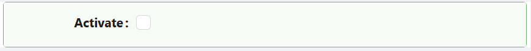

# Checkbox

The Checkbox component provides a simple yet essential control that allows users to make a binary choice — checked or unchecked.

## **Properties**

The following properties are available to configure the behavior of the component from the form editor (this is in addition to [common properties](/docs/front-end-basics/form-components/common-component-properties)).

### Common

#### **Default Checked** ``boolean``

Choose whether the checkbox is checked by default when the form loads.
