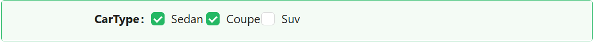

# Checkbox

The Checkbox component provides a simple yet essential control that allows users to make a binary choice — checked or unchecked.

## **Properties**

The following properties are available to configure the behavior of the component from the form editor (this is in addition to [common properties](/docs/front-end-basics/form-components/common-component-properties)).

### Common

#### **Property Name** ``string``

This is the identifier used to bind the component to a form’s data model. It’s mandatory and must be unique within the form.

#### **Label** ``object``

Customize whether to display a label. Hiding it can simplify the UI in some layouts.

#### **ToolTip** ``string``/``function``

Provides extra context via a hover message — perfect for subtle hints.

#### **Edit mode** ``object``

Set the component's behavior:

- **Inherited *(default)***: The checkbox inherits its settings from the parent form.

- **Editable**: Users can toggle the checkbox on or off.

- **Read Only**: Users can view the state but cannot change it.

#### **Hide** ``boolean``

Allows the component to be conditionally hidden from the form.

#### **Default Checked** ``boolean``

Choose whether the checkbox is checked by default when the form loads.

___

### Appearance

####  **Custom Styles** ``function``

Inject your own CSS styles via JavaScript (must return a style object).

___

### Validation

#### **Required** ``boolean``

Ensure users must interact with the checkbox before submission by marking it as required.
