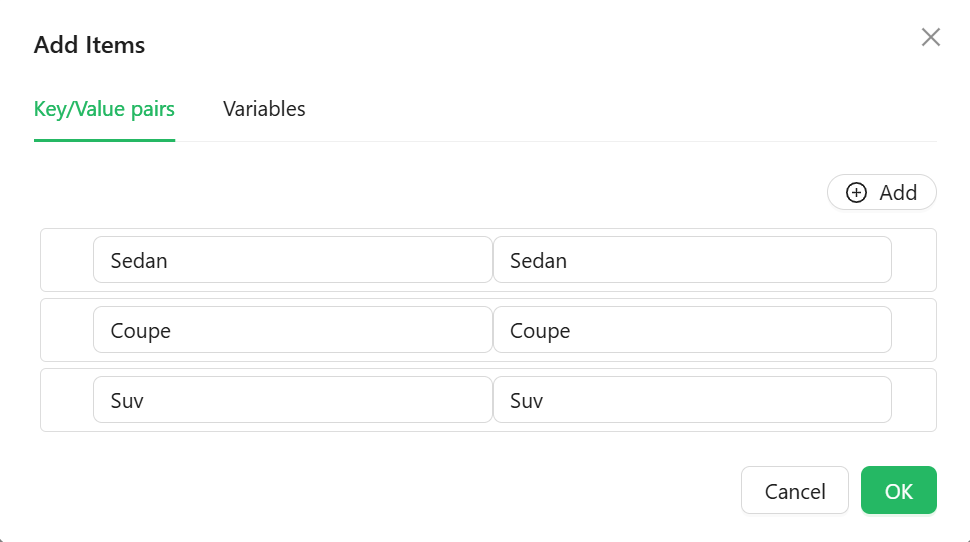

# Checkbox Group

The Checkbox Group component allows users to select one or multiple options from a list. Whether you're letting users choose their interests or settings, this component brings clarity and control with every click.

## **Properties**

The following properties are available to configure the behavior of the component from the form editor (this is in addition to [common properties](/docs/front-end-basics/form-components/common-component-properties)).

### Common

#### **Property Name** ``string``

This is the identifier used to bind the component to a form’s data model. It’s mandatory and must be unique within the form.

#### **Label** ``object``

Customize whether to display a label. Hiding it can simplify the UI in some layouts.

#### **ToolTip** ``string``/``function``

Provides extra context via a hover message — perfect for subtle hints.

#### **Mode** ``object``

Toggle between **single** and **multiple** selection modes depending on the use case.

#### **Edit mode** ``object``

Select between Editable, Read Only, or Inherited from the form.

#### **Hide** ``boolean``

Allows the component to be conditionally hidden from the form.

___

### Data

#### **Data Source Type** ``object``

Choose the source of checkbox items: from predefined values, a reference list, or a remote API.

#### Items

Manually enter label-value pairs for the checkboxes. Useful for static lists.

___

### Validation

#### **Required** ``boolean``

Mark the checkbox group as required. Ensures at least one option is selected before form submission.

___

### Appearance

#### **Direction** ``object``

Decide if the checkboxes are arranged horizontally or vertically.

####  **Custom Styles** ``function``

Inject your own CSS styles via JavaScript (must return a style object).

