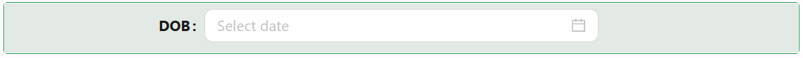

# Date Field

The Date Field component offers users a clean, flexible way to select dates, times, or ranges. It includes support for various picker modes, time formats, and detailed validation options.

## **Properties**

The following properties are available to configure the behavior of the component from the form editor (this is in addition to [common properties](/docs/front-end-basics/form-components/common-component-properties)).

### Common

#### **Property Name** ``string``

Unique identifier used to bind the component's value to your data model.

#### **Label** ``object``

Customize whether to display a label. Hiding it can simplify the UI in some layouts.

#### **Picker** ``object``

Choose the mode of the picker:

- date *(default)*: Pick a single calendar date.

- week: Select a week of the year.

- month: Pick a specific month.

- quarter: Select a business quarter.

- year: Pick an entire year.

#### **Range** ``boolean``

Enable to allow selecting a range of dates instead of a single date.

#### **Resolve to UTC** ``boolean``

Automatically convert the selected date and time to UTC.

#### **Placeholder** ``string``/``function``

Shows hint text inside the input to guide users on what to enter.

#### **Tooltip**  ``string``/``function``

Provides extra context via a hover message — perfect for subtle hints.

#### **Edit Mode**  ``object``

Control the input mode:

- Inherited *(default)*: The field inherits editability from the parent form.

- Editable: Users can freely select a date.

- Read Only: The field is visible but not changeable.

#### **Hide** ``boolean``

Allows the component to be conditionally hidden from the form.

___

### Formats

#### **Date Format** ``string``/ ``function``

Defines the format for dates (default: ``DD/MM/YYYY``).

#### **Time Format** ``string``/ ``function``

Defines the time display format (default: ``HH:mm:ss``).

#### **Year Format** ``string``/ ``function``

Specifies the format for year selection (default: ``YYYY``).

#### **Quarter Format** ``string``/ ``function``

Sets the format for quarter picking (default: ``YYYY-\QQ``).

#### **Month Format** ``string``/ ``function``

Format used when selecting a month (default: ``YYYY-MM``).

#### **Week Format** ``string``/ ``function``

Format used when selecting a week (default: ``YYYY-wo``).

___

### Control Visibility

#### **Show Time** ``boolean``

Enable this to allow users to select a time along with the date.

#### **Show Today/Now** ``boolean``

Display a shortcut for today’s date or the current time.

#### **Disabled Date Mode** ``boolean``

Choose a method for disabling dates:

- None *(default)*: All dates selectable.

- Function Template: Use predefined templates to disable dates.

- Custom Function: Write custom JavaScript to decide which dates to disable.

___

### Validation

#### **Required** ``boolean``

Ensures the field must be filled out before form submission.

___

### Appearance

#### **Font** ``object`` 

Customize how your tab labels look. Choose the font family, size, weight, and color.

#### **Dimensions** ``object`` 

Specify the size of your component:
- Width, Height
- Min/Max Width and Height
- Overflow behavior

#### **Border** ``object`` 

Personalize the borders:
- Set border width, color, and style
- Round the corners for a softer touch

#### **Background** ``object``

Pick your flavor of background:

- Color
- Gradient
- Image URL
- Uploaded Image
- Stored File

Also tweak background size, position, and repeat behavior.

#### **Shadow** ``object`` 

Give depth with adjustable shadows:

- Offset, Blur, Spread, Color

#### **Margin & Padding** ``object``

Fine-tune spacing inside and around the component.

####  **Custom Styles** ``function``

Inject your own CSS styles via JavaScript (must return a style object).