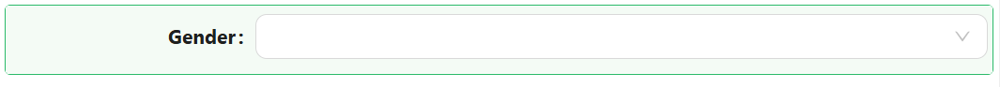
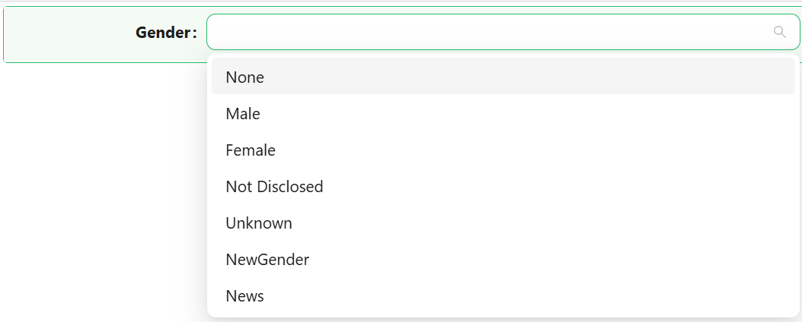
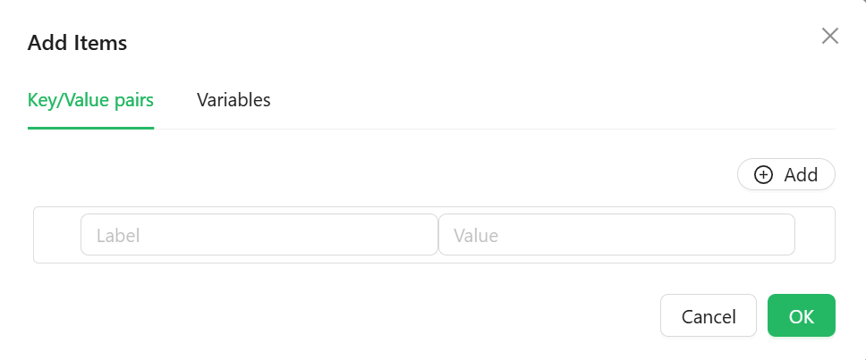

# Dropdown

The Dropdown component offers users a sleek and powerful way to select one or more options from a list. It supports custom data sources, label/value configuration, and advanced filtering.

## **Properties**

The following properties are available to configure the behavior of the component from the form editor (this is in addition to [common properties](/docs/front-end-basics/form-components/common-component-properties)).

#### **Property Name** ``string``

The internal name of the field, used to bind it to data. This is essential for the component to function properly in the form.

*Note: In our examples, you might see a property name like ``gender``. This is just for illustration — you're free to name the property whatever suits your domain.*

#### **Label** ``string``

Controls whether the label for the component should be shown. Optionally hides it for a cleaner UI.

#### **Placeholder** ``string``

Text shown when no option is selected. Handy for prompting users on what to choose.

#### **Tooltip** ``string``

A helper text shown when hovering over the component .

#### **Edit Mode** ``object``

Toggles between Editable, Read Only, or Inherited from the form. Flexible for all kinds of scenarios.

#### **Hide** ``boolean``

Controls the visibility of the dropdown.

___

### Data

#### **Default Value** ``string``

Set a pre-selected default item. Especially useful when you want to provide an initial value.

#### **Mode** ``Object``

Switch between single, multiple, or tag selection.

#### **DataSource Type** ``Object``

Choose how the dropdown gets its values: from static values, reference lists, or a remote URL.

#### **Value** 

Manually define the dropdown entries via label-value pairs. Ideal for short, custom lists.

*Note: Click the **Variables** pane to see the variables, descriptions and datatypes allowed*

___

### Validation

#### **Required** ``boolean``

Marks the dropdown as mandatory. Ensures that a user must make a selection.

___

### Appearance

#### **Font** ``object`` 

Customize the dropdown's font family, weight, color, and alignment.

#### **Dimensions** ``object`` 

Specify the size of your component:
- Width, Height
- Min/Max Width and Height

#### **Border** ``object`` 

Personalize the borders:
- Set border width, color, and style
- Round the corners for a softer touch

#### **Background** ``object``

Pick your flavor of background:

- Color
- Gradient
- Image URL
- Uploaded Image
- Stored File

#### **Shadow** ``object`` 

Give depth with adjustable shadows:

- Offset, Blur, Spread, Color

#### **Margin & Padding** ``object``

Fine-tune spacing inside and around the dropdown.

####  **Custom Styles** ``function``

Inject your own CSS styles via JavaScript (must return a style object).
