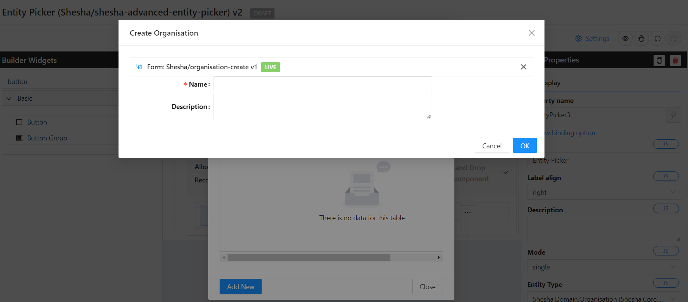

# Entity Picker

EntityPicker displays an entity instance in a text field and performs actions when the user clicks buttons on the right.

<iframe width="100%" height="500" src="http://localhost:4000/shesha/forms-designer?id=f7bd1dce-fd86-45f2-9177-b3c489b886c3" title="Entity Picker Component" ></iframe>

Use EntityPicker if:

- The field value is a reference to an entity instance.
- Users need to select or create an entity instance via the lookup screen or enter a specific value.

## Content Properties

These properties are customizable options present in the property pane of the component, allowing users to modify the component according to their preferences. All of the properties contain a Javascript editor which allows users to execute Javascript expressions to control the component.

### Entity Type

- Drop down of all the entities available in the systems to bind to the component as options.

### Columns

- Adding columns relevant to your entity selected so you can see more information of the field to help you make the correct selection.

### Allow New Record

- When this is toggled on, it allows for the creation of an entity instance via the lookup screen.

- #### Dialog Settings

  - **Title**

    - This is the title of the dialog that will render while within the lookup screen.

  - **Modal Form**

    - This brings a dropdown list of all the forms that are available in the system and can be rendered as a dialog.

  - **Show Modal Buttons**

    - If this is toggled on, this provides the ability to make API calls with information contained in your dialog form.

  - **Submit Http Verb**

    - This is a dropdown of the different API calls that can be made from the dialog data. Options: POST, PUT. This will use the POST or PUT settings as specified in your dialog form.

  - **Dialog Width**
    - This specifies the width of the rendered dialog. Options: Small, Middle, Large, Custom.
