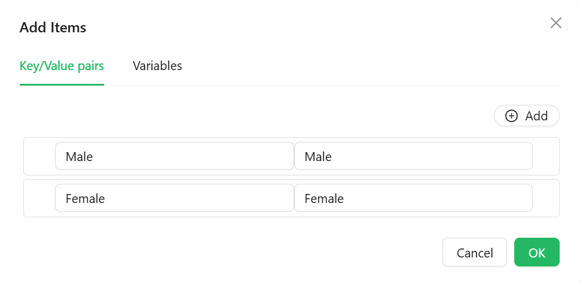

# Radio

The Radio component allows users to make a single selection from a predefined set of options. It supports dynamic data sources, orientation control, and custom styling.

## **Properties**

The following properties are available to configure the behavior of the component from the form editor (this is in addition to [common properties](/docs/front-end-basics/form-components/common-component-properties)).

### Common

#### **Label** ``object``

Controls whether the label for the component is shown. Helpful for clarity or clean layouts.

#### **ToolTip** ``string``/``function``

Provides extra context via a hover message — perfect for subtle hints.

#### **Edit mode** ``object``

Set the component’s interaction behavior:

- **Inherited *(default)***: Behavior is inherited from the parent form.

- **Editable**: Users can set and change their radio button.

- **Read Only**: Users can view the radio button but cannot change it.

#### **Hide** ``boolean``

Allows the component to be conditionally hidden from the form.

#### **Default Value** ``string``/``function``

Set the default selected radio option when the form loads.

___

### Data

#### Items

Define label-value pairs for the radio group directly.

___

### Validation

#### **Required** ``boolean``

Makes selection mandatory. Ensures users can't skip over this field.

___

### Appearance

####  **Custom Styles** ``function``

Inject your own CSS styles via JavaScript (must return a style object).

