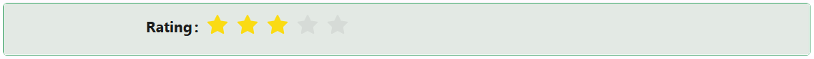

# Rate

The Rate component gives users a fun and interactive way to provide feedback or ratings. Whether it’s stars, hearts, or custom icons, users can quickly express their opinions with style.

## **Properties**

The following properties are available to configure the behavior of the component from the form editor (this is in addition to [common properties](/docs/front-end-basics/form-components/common-component-properties)).

### Common

#### **Property Name** ``string``

Unique identifier used to bind the component's value to your data model.

#### **Label** ``object``

Customize whether to display a label. Hiding it can simplify the UI in some layouts.

#### **Tooltip**  ``string``/``function``

Provides extra context via a hover message — perfect for subtle hints.

#### **Max Rating**  ``number``/``function``

Define the maximum number of rating items (like 5 stars, 10 hearts, etc.)

#### **Icon** ``object``

Choose a custom icon for the rating (default is usually a star if not specified).

#### **Edit Mode** ``object``

Set the component’s interaction behavior:

- Inherited *(default)*: Behavior is inherited from the parent form.

- Editable: Users can set and change their rating.

- Read Only: Users can view the rating but cannot change it.

#### **Hide** ``boolean``

Allows the component to be conditionally hidden from the form.

___

### Appearance

####  **Custom Styles** ``function``

Inject your own CSS styles via JavaScript (must return a style object).