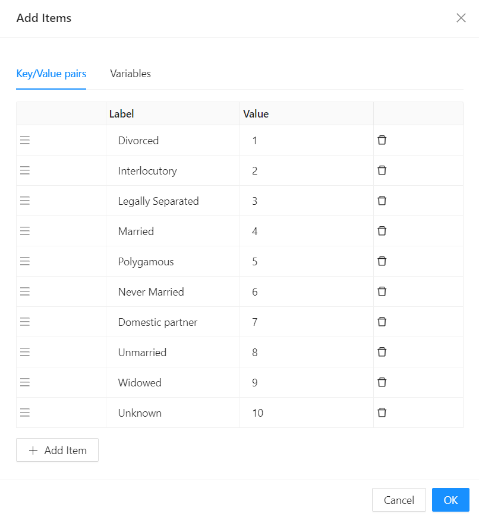

# Checkbox / Checkbox Group / Radio / Dropdown

Used for selecting multiple values from several options. If you use only one checkbox, it is the same as using Switch to toggle between two states. The difference is that Switch will trigger the state change directly, but Checkbox just marks the state as changed and this needs to be submitted.

[//]: # '<iframe width="100%" height="500" src="https://pd-docs-adminportal-test.shesha.dev/shesha/forms-designer/?id=f8794ef7-d146-4422-b523-4f34474c4fa3" title="Selects Components" ></iframe>'

## Properties

The following properties are available to configure the behavior of the component from the form editor (this is in addition to [common properties](/docs/front-end-basics/form-components/common-component-properties).

### Default Checked

- Specifies the initial state: whether or not the checkbox is selected

### Selection Mode

- Set mode of selection. Options: Single (Single value), Multiple (Array of values)

### DataSourceType

- Reference List
  - This provides a dropdown list of all the reference lists available in the application.
- Values
  
- API Url
  - Data Source Url 
    Allows for Javascript expressions that return the Url to be used to fetch data for the checkbox.
     E.g. `return "api/services/app/ReferenceList/GetItems?module=Shesha&name=Shesha.Core.Gender"`

### Reducer Function

- Allows for a Javascript reducer function for the data returned from the server. The function is responsible for value and label props. The function should return an array of objects of this format: `{value, label}`
   E.g. `return data?.map(({itemValue, item }) => ({ value: itemValue, label: item }));`
