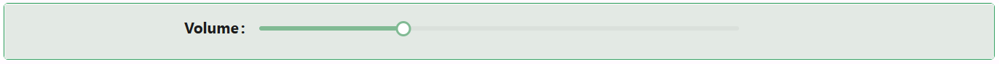

# Slider

The Slider component offers an intuitive way for users to select a numeric value by sliding a handle across a track. It supports minimum and maximum bounds, a default value, and fully customizable styling — great for ratings, percentages, or range selectors.

## Properties

The following properties are available to configure the behavior of the component from the form editor (this is in addition to [common properties](/docs/front-end-basics/form-components/common-component-properties)).

### Common
#### **Property Name** `string`
A unique key that links the slider value to your form data.

#### **Label** ``object``

Customize whether to display a label. Hiding it can simplify the UI in some layouts.

#### **Edit Mode** `object`
Controls how the slider behaves:
- **Editable**: Users can adjust the slider.
- **Read Only**: Slider is locked.
- **Inherited** *(default)*: Behavior is inherited from the parent form.

#### **Hide** `boolean`
Control whether the slider is shown.

___

### Data

#### **Default Value** `number`
Sets the initial position of the slider when the form loads.

#### **Minimum** `number`
The minimum allowable value on the slider.

#### **Maximum** `number`
The maximum allowable value on the slider.

___

### Appearance

#### **Custom Style** `function`
Write a JavaScript function that returns a `CSSProperties` object to style the slider dynamically.

