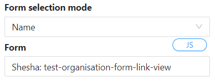
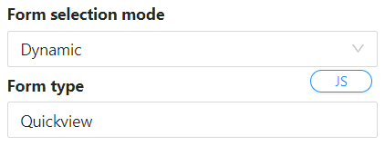
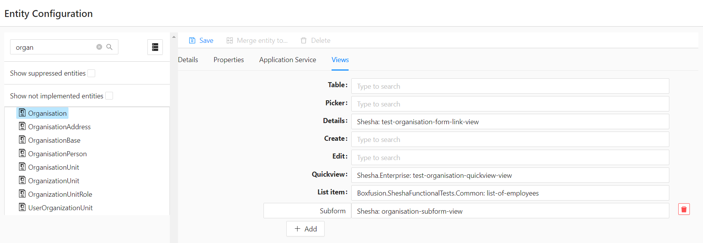
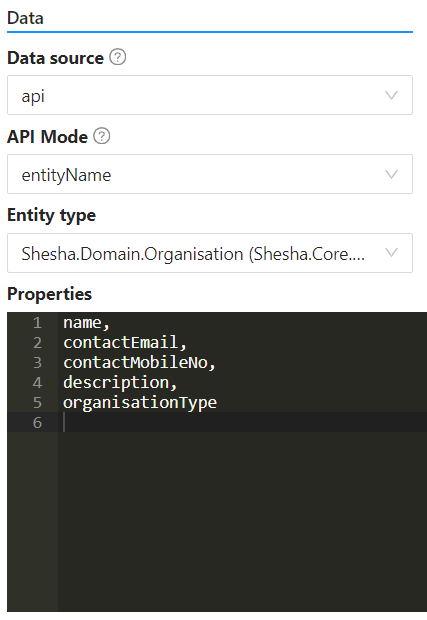

# Subform Component

A subform is a component used for displaying nested forms. It is a reusable section or module that contains a specific set of functionalities, fields, or elements. It allows you to encapsulate a group of related elements or controls within a form or a larger application, making it easier to manage and reuse across different parts of your project.

The subform component operates much like a template or a mini-form within the larger application. Instead of recreating the same layout or set of functionalities multiple times, you can create a subform once and then use it multiple times within the main form or across various forms in your application.

In the below example, the subform component was configured with a name of `organisations`, and the 'autocomplete' field was dragged onto the designer as a data source for the subform since we are on the form designer.

<iframe width="100%" height="500" src="http://localhost:4000/shesha/forms-designer?id=9ec18548-0e4f-400f-b6f7-bb1f0c7dee39" title="Sub Form Component" ></iframe>

## Content Properties

These properties are customizable options present in the property pane of the component, allowing users to modify the component according to their preferences. All of the properties contain a Javascript editor which allows users to execute Javascript expressions to control the component.

### Property Name

- The name of the property. Very important to pre-populate the form with data. It is also important to note that all the form fields are going to be prefixed with this name that you will have provided here. For example, if you entered 'subForm' as the name and the form has a property like 'firstName', the new name will be 'subForm_firstName'.

### Form Selection

- Options:

  - **Name**

    - User selects a specific form to be bound to the subform by typing the form name onto the autocomplete.

    

  - **Dynamic**

    - User selects the form type. These forms are specified in the 'Entity Configurations' view, which provides a centralized repository of the different types of views and which form should be rendered based on the scenario.

    
    

### Data Source

- Options:
  - **Form (Default)**
    - The main form will be responsible for populating this component with data.
  - **API**
    - The form will be responsible for fetching its own data from the backend.

### API Mode

- Options:
  - **Entity Name**
    - By default, the GET URL that is used is `/api/services/app/Entities/Get`. This will do a default 'GET' of the entity you have selected.
  - **Entity Type**
    - This provides a dropdown of all the entities available in the application that the subform component can then be binded to.

### Properties

- This provides an editor for the user to enter the values that they want to be able to tap into on the binded for. For example, if you have binded a form which is supposed to get 'Organisation' information from the 'Organisation' entity scheme, you would list out that you would like to access the following information like this:

  

### URL

- This is used in the cases where you want to override the default 'GET' URL that is being utilized when the Entity Type has been selected.

### GET URL

- This provides a code editor to return a string that will be used to make the 'GET' API call to the backend, should you not want to use the default API provided. For example, `return '/api/dynamic/Shesha/Organisation/Get';`.

### Query Params

- This provides a code editor in which the user can enter the code that returns the query parameters to be used to fetch the data. This should be a function that returns an object with the expected query parameters for the provided API. This is usually the entity Id. For example:

  ```javascript
  return { id: `${data.organisations.id}` };
  ```
