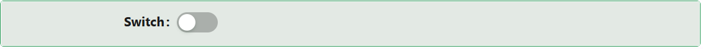

# Switch

The Switch component is a simple and stylish way to toggle between two states — ON and OFF. Perfect for enabling features, toggling settings, and creating interactive forms.

## **Properties**

The following properties are available to configure the behavior of the component from the form editor (this is in addition to [common properties](/docs/front-end-basics/form-components/common-component-properties)).

### Common

#### **Property Name** ``string``

Unique identifier used to bind the component's value to your data model.

#### **Label** ``object``

Customize whether to display a label. Hiding it can simplify the UI in some layouts.

#### **Tooltip**  ``string``/``function``

Provides extra context via a hover message — perfect for subtle hints.

#### **Edit Mode**  ``object``

Configure the switch's interactivity:

- **Inherited *(default)***: The switch inherits the editable or read-only state from the parent form.

- **Editable**: Users can toggle the switch freely.

- **Read Only**: The switch is visible but cannot be changed.

#### **Hide** ``boolean``

Allows the component to be conditionally hidden from the form.

___

### Appearance

#### **Size** ``object``

Select the size of the switch:

- **Default *(default)***: The standard size for the switch.

- **Small**: A compact version of the switch.

####  **Custom Styles** ``function``

Inject your own CSS styles via JavaScript (must return a style object).