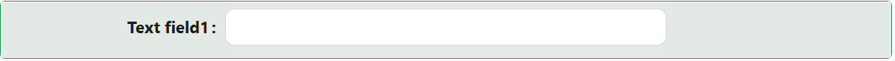

# Text Field

The Text Field component provides a clean, customizable input for short strings like names, titles, or search queries.

[//]: # '<iframe width="100%" height="500" src="https://pd-docs-adminportal-test.shesha.dev/shesha/forms-designer/?id=e3191b51-4a87-4187-910e-177bcbed657b" title="Text Field Component" ></iframe>'

## Properties

The following properties are available to configure the behavior of the component from the form editor (this is in addition to [common properties](/docs/front-end-basics/form-components/common-component-properties).

### Common

#### **Property Name** ``string``

Unique identifier used to bind the component's value to your data model.

#### **Label** ``object``

Customize whether to display a label. Hiding it can simplify the UI in some layouts.

#### **Placeholder** ``string``/``function``

Shows hint text inside the input to guide users on what to enter.

#### **Tooltip**  ``string``/``function``

Provides extra context via a hover message — perfect for subtle hints.

#### **Edit mode** ``object``

Set the component’s interaction behavior:

- **Inherited *(default)***: Behavior is inherited from the parent form.

- **Editable**: Users can set and change the text field.

- **Read Only**: Users can view the text field but cannot change it.

#### **Type** ``object``
Specify the input type:

- **Text *(default)***: Regular text input.

- **Password**: Masks the entered text for sensitive information.

#### **Default Value**  ``string``/``function``

Set a pre-filled value for the component.

#### **Prefix & Prefix Icon** ``string``/``function``

Add a prefix text or icon (e.g., currency symbols) before the text.

#### **Suffix & Suffix Icon** ``string``/``function``

Display text or icons after the text (e.g., units like %, kg).

#### **Spell Check** ``boolean``

Allows the browser to detect typos.

___

### Validation

#### **Required** ``boolean``

Ensures the field must be filled out before form submission.

#### **Min Length / Max Length** ``number``

Set how short or long the input must be.

#### **Message** ``string``/``function``

Custom message displayed when validation fails.

#### **Validator** ``function``

Provide a custom validation function using JavaScript. Return a Promise for async checks.

___

### Appearance

#### **Font** ``object`` 

Customize how your tab labels look. Choose the font family, size, weight, and color.

#### **Dimensions** ``object`` 

Specify the size of your component:
- Width, Height
- Min/Max Width and Height
- Overflow behavior

#### **Border** ``object`` 

Personalize the borders:
- Set border width, color, and style
- Round the corners for a softer touch

#### **Background** ``object``

Pick your flavor of background:

- Color
- Gradient
- Image URL
- Uploaded Image
- Stored File

Also tweak background size, position, and repeat behavior.

#### **Shadow** ``object`` 

Give depth with adjustable shadows:

- Offset, Blur, Spread, Color

#### **Margin & Padding** ``object``

Fine-tune spacing inside and around the component.

####  **Custom Styles** ``function``

Inject your own CSS styles via JavaScript (must return a style object).