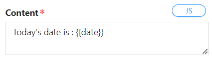
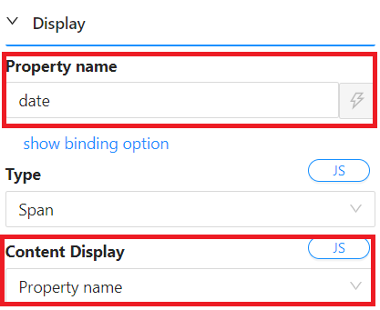

# Text

This refers to a UI element or module that is responsible for displaying text content on a webpage. Text components can vary in complexity and functionality, and they are a fundamental part of building user interfaces.

## Content Properties

These properties are customizable options present in the property pane of the component, allowing users to modify the component according to their preferences. All of the properties contain a Javascript editor which allows users to execute Javascript expressions to control the component.

### Type

- **Options**
  - Span
  - Paragraph
  - Title

### Content Display

- #### Content

  - The text you want to be shown should be inserted in this property. This also accepts dynamic `mustuche templating` values to make the content displayed more flexible. In the below example, we have `date`, as part of the [form data](/docs/front-end-basics/configured-views/data-types/shesha-objects/data) object.

    

  _The rendered result will look like this: `Today's date is : 2023-12-09`_

- ### Property Name

  - This allows you to tap into your [form data](/docs/front-end-basics/configured-views/data-types/shesha-objects/data) object and display the content. In the below example, we are tapping into the `date` property on the form data.

    

  _The rendered result will look like this: `2023-12-09`_

### Data Type

- This allows the user to specify the data type of the text component, utlimately deciding the look and format of the rendered text.
- **Options:**
  - **String**
  - **Number**
    - Formats: Round, Currency, Double, Thousand Separator
  - **Boolean**
  - **DateTime**
    - This provides an interface in which to alter the format of the rendered text. Please refer to [this document](https://day.js.org/docs/en/display/format) for formatting.
