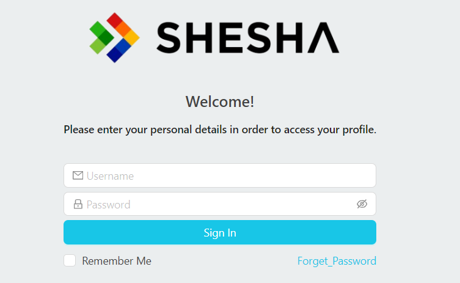

# Design

## Introduction

The new form login page is now configurable. A default configuration page is available on the latest Shesha. If an old version of Shesha is used this login configuration page will be available when the latest migrations are merged.
The form configuration is `Shesha/login`. (`Shesha` being the module and `login` being the name). The default login page that comes with Shesha will be able to login by default but is also capable of customizing certain actions before and after the login process.

## Look and Feel

The look and feel of the configurable login page are the same as the standard login page. Although it is designed exactly the same as the previous login page, you can change the design completely depending on the requirements.

