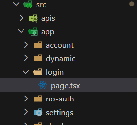

# Implementation

## Introduction
In the directory `src\app\login\page.tsx` remove the entire content and replace it with snippet below.

#### Navigation


#### Replacement Content

``` ts
'use client';

import React from 'react';
import { ConfigurableForm } from '@/components';
import { LOGIN_CONFIGURATION } from '@/components/mainLayout/constant';
import { FormFullName } from '@/providers';
import { PageWithLayout } from '@/index';

interface IProps {}

const Login: PageWithLayout<IProps> = () => (
  <ConfigurableForm mode={'edit'} formId={LOGIN_CONFIGURATION as FormFullName} />
);

export default Login;
```
