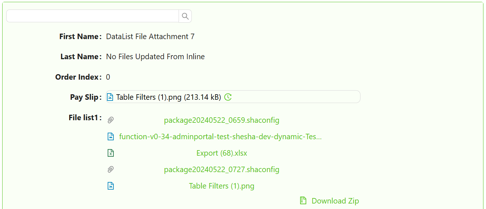

# DataList

import LayoutBanners from './LayoutBanners';

The DataList component is intended to get a list of data (similar to using it with the DataTable component). It shows data from the DataTableContext as a list of sub-forms. The `DataList` component should be placed inside the `DataTableContext` component. Note that other DataTableContext-specific components (Pager, Quick Search, Table view selector) can also affect the `DataList`, similar to the [`DataTable`](/docs/front-end-basics/form-components/tables-lists/datatable.md).

[//]: # (<iframe width="100%" height="500" src="https://pd-docs-adminportal-test.shesha.dev/shesha/forms-designer/?id=cf652775-9c95-44e4-8152-8c52f174d830" title="Columns Component" ></iframe>)

## **Get Started**

*NB: This guide assumes the DataTable Context is already set up. [Learn how to configure it here.](../tables-lists/datatable-context.md#get-started)*

<LayoutBanners url="https://app.guideflow.com/embed/qp7wmnvtjk" type={1}/>

## Properties

The following properties are available to configure the behavior of the component from the form editor (this is in addition to [common properties](/docs/front-end-basics/form-components/common-component-properties)).

### Data

#### **Form Selection Mode** `object`  
Defines how the form is selected:
- **Named form**
- **View type**
- **Expression**

#### **Modal Form** `string`  
The form opened when a list item is selected (Required).

#### **Selection Mode** `object`  
Item selection type:
- None *(default)*
- Single
- Multiple

#### **Can Edit Inline** `object`  
Edit items directly within the list:
- Yes
- No
- Inherit *(default)*
- Expression

#### **Can Delete Inline** `object`  
Delete items inline:
- Yes
- No
- Inherit *(default)*
- Expression

#### **Can Delete Inline Expression** `function`  
Return `true` to allow inline deletion, `false` otherwise.

___

### Appearance

#### **Orientation** `object`  
Display direction:
- Vertical *(default)*
- Horizontal
- Wrap

#### **Card Minimum Width** `string`  
Used only in *Wrap* orientation. Supports CSS units.

#### **Card Maximum Width** `string`  
Used only in *Wrap* orientation. Supports CSS units.

#### **Card Height** `string`  
Used only in *Wrap* orientation. Supports CSS units.

#### **Card Spacing** `string`  
Used only in *Wrap* orientation. Supports CSS units.

#### **Collapsible** `boolean`  
Choose if the component should be collapsible.

#### **Collapsible By Default** `boolean`  
Choose if the component should be collapsible by default.

#### **Icon** `object`  
Icon shown when the list is empty.

#### **Primary Text** `string`  
Displayed when no data is available. *(default: "No Data")*

#### **Secondary Text** `string`  
Subtext shown with no data. *(default: "No data is available for this data list")*

