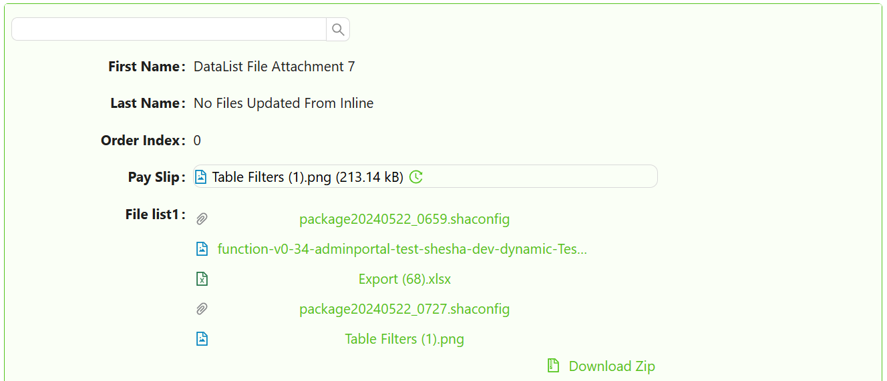

import LayoutBanners from './LayoutBanners';

# DataList

A DataList displays a collection of records as a list of repeating sub-forms. Where a DataTable shows data in rows and columns, a DataList gives you complete control over how each item looks by rendering a fully configured form for every record. You can use it to build card-style layouts, custom list items, or any repeating pattern that a grid cannot express.

A DataList reads its data from a parent `DataTableContext` component. The same Pager, Quick Search, and Table View Selector components that work with a DataTable also work with a DataList, because both share the same data context.


*A DataList rendering a collection of records as repeating sub-forms.*

## Get Started

:::info
This guide assumes a DataTableContext is already configured on your form. [Learn how to set one up here.](../tables-lists/datatable-context.md#get-started)
:::

<LayoutBanners url="https://app.guideflow.com/embed/qp7wmnvtjk" type={1}/>

---

## Properties

The following properties are available to configure the behavior of the component from the form editor (this is in addition to [common properties](/docs/front-end-basics/form-components/common-component-properties)).

---

#### **Selection Mode** `object`

Selection Mode controls whether the user can select items in the list and how many they can select at once.

| Option | Behaviour |
|---|---|
| `None` | Items cannot be selected. No selection UI is shown. This is the default. |
| `Single` | The user can select one item at a time. Clicking a selected item deselects it. |
| `Multiple` | Checkboxes appear on each item. The user can select any number of items. A Select All checkbox appears at the top. |

---

### Render

#### **Form Selection Mode** `object`

Form Selection Mode controls which form Shesha renders for each item in the list. There are three options.

| Mode | When to use |
|---|---|
| `Named form` | You always want to render the same specific form for every item. Select it from the form picker. |
| `View type` | The form to render is determined by the entity type and a form type (e.g. `ListItem`, `details`). Shesha resolves the correct form at runtime. |
| `Expression` | You write a JavaScript expression that returns a form identifier at runtime. Use this when the form depends on conditions that cannot be expressed with the other modes. |

When mode is `Named form`, set **Form** to the specific form you want to render for each item.

When mode is `View type`, set **Form Type** to the type of form to look up. Shesha uses the entity type to find the matching registered form.

When mode is `Expression`, write a JavaScript expression in **Form Identifier Expression** that returns an object with `name` and `module` properties identifying the form.

**Example - Return a form identifier dynamically based on item type:**
```js
// item is the current list record being rendered
return item.contactType === 1
  ? { name: 'person-list-item', module: 'MyApp' }
  : { name: 'organisation-list-item', module: 'MyApp' };
```

:::warning
The DataList must be placed inside a DataTableContext component. Without a parent data context, the component has no data source and will not render any items.
:::

---

#### **Orientation** `object`

Controls the layout direction of items in the list.

| Option | Behaviour |
|---|---|
| `Vertical` | Items stack top to bottom. This is the default. |
| `Horizontal` | Items sit side by side in a row. |
| `Wrap` | Items flow left to right and wrap onto new rows. |

---

#### **List Item Width** `object`

Appears when Orientation is `Horizontal`. Controls the width of each item as a fraction of the available space.

| Option | Width |
|---|---|
| `100%` | Full width |
| `50%` | Half width |
| `33%` | One third |
| `25%` | One quarter |
| `(Custom)` | Enter a pixel value in **Custom List Item Width** |

---

#### **Custom List Item Width** `number`

Appears when List Item Width is set to `(Custom)`. Enter the width in pixels.

---

#### **Card Minimum Width** `string`

Appears when Orientation is `Wrap`. Sets the minimum width of each card. Accepts any CSS unit (e.g. `200px`, `30%`, `20rem`).

---

#### **Card Maximum Width** `string`

Appears when Orientation is `Wrap`. Sets the maximum width of each card. Accepts any CSS unit.

---

#### **Card Height** `string`

Appears when Orientation is `Wrap`. Sets a fixed height for every card. Accepts any CSS unit.

---

#### **Card Spacing** `string`

Appears when Orientation is `Wrap`. Controls the space between cards. Accepts any CSS unit.

---

#### **Show Border** `boolean`

Appears when Orientation is `Wrap`. When enabled, a border is drawn around each card.

---

### CRUD

#### **Can Edit Inline** `object`

Controls whether the user can edit existing records directly within the list.

| Option | Behaviour |
|---|---|
| `Yes` | Edit controls appear on each item. |
| `No` | Editing inline is disabled. |
| `Inherit` | Inherits from the parent DataTableContext. This is the default. |

When Can Edit Inline is set to `Yes` or `Inherit`, the following additional settings appear.

**Show Edit Icon** — When enabled, a dedicated edit icon appears on each list item so the user can click it to enter edit mode. When disabled, the item itself is the edit trigger.

**Custom Update URL** — An optional API endpoint to use instead of the standard entity update endpoint. Leave blank to use the default.

---

#### **List Edit Mode** `object`

Appears when Can Edit Inline is `Yes` or `Inherit`. Controls how many items can be in edit mode at once.

| Option | Behaviour |
|---|---|
| `One by one` | Only one item can be in edit mode at a time. Switching to another item saves or cancels the current edit. |
| `All at once` | All items are editable simultaneously. Use this for bulk editing scenarios. |

---

#### **Save Mode** `object`

Appears when Can Edit Inline is `Yes` or `Inherit`. Controls when edited values are saved to the backend.

| Option | Behaviour |
|---|---|
| `Auto` | Shesha saves the item automatically when the user moves focus away from the edited field. |
| `Manual` | Save and cancel buttons appear on the item. The user must explicitly confirm or discard changes. |

---

#### **Can Add Inline** `object`

Controls whether the user can add new records directly from the list without navigating to a separate form.

| Option | Behaviour |
|---|---|
| `Yes` | An add button appears. Clicking it opens a create form in a modal dialog. |
| `No` | Adding inline is disabled regardless of the parent context. |
| `Inherit` | The list inherits the add capability from the parent DataTableContext. This is the default. |

When Can Add Inline is set to `Yes` or `Inherit`, the following additional settings appear.

**Create Form** — Selects the form that opens in the dialog when the user adds a new item. When Form Selection Mode is `Named form`, pick the form from the **Create Form** picker. When Form Selection Mode is `View type`, enter the **Create Form Type** instead. Defaults to the same form used to render list items if not set.

**Dialog Width (%)** — Controls the width of the modal dialog. Choose `Small` (40%), `Medium` (60%), `Large` (80%), or `Custom`. When `Custom` is selected, choose the **Units** (Percentage or Pixels) and enter the value in **Enter Custom Width**.

**Custom Create URL** — An optional API endpoint to use instead of the standard entity create endpoint. Leave blank to use the default.

---

#### **New List Item Init** `function`

Appears when Can Add Inline is `Yes` or `Inherit`. A JavaScript function that runs before the create form opens for a new item. Return an object from this function to pre-populate fields in the create form.

Available variables: `formData`, `globalState`, `http`, `moment`, `contexts`.

**Example - Pre-populate fields on a new item:**
```js
// formData is the parent form's current data.
return {
  status: 1,
  organisationId: formData.id,
};
```

---

#### **On List Item Save** `function`

Appears when Can Add Inline or Can Edit Inline is enabled. A JavaScript function that runs before an inline edit or create is submitted to the backend. Return the modified data object from this function. Throw an error to cancel the save.

Available variables: `data`, `formData`, `globalState`, `http`, `moment`, `message`, `contexts`.

**Example - Validate before saving:**
```js
if (!data.emailAddress) {
  throw new Error('Email address is required.');
}
return data;
```

---

#### **On List Item Save Success** `function`

Appears when Can Add Inline or Can Edit Inline is enabled. Fires after an inline create or edit is successfully saved to the backend. Use this to show a confirmation message or refresh related data.

Available variables: `data`, `formData`, `globalState`, `http`, `moment`, `contexts`.

---

#### **Can Delete Inline** `object`

Controls whether the user can delete records directly from the list.

| Option | Behaviour |
|---|---|
| `Yes` | A delete control appears on each item. |
| `No` | Inline deletion is disabled. |
| `Inherit` | Inherits from the parent DataTableContext. This is the default. |

When Can Delete Inline is set to `Yes` or `Inherit`, the following additional settings appear.

**Custom Delete URL** — An optional API endpoint to use instead of the standard entity delete endpoint. Leave blank to use the default.

---

#### **On Row Delete Success** `function`

Appears when Can Delete Inline is `Yes` or `Inherit`. Fires after an inline delete completes successfully. Use this to show a confirmation message or update related parts of the form.

Available variables: `data`, `formData`, `globalState`, `http`, `moment`, `contexts`.

---

### Grouping

:::note
The Grouping section only appears when Orientation is set to `Vertical` or `Horizontal`. It is hidden when Orientation is `Wrap`.
:::

#### **Collapsible** `boolean`

When enabled, grouped sections within the list show a collapse/expand toggle. Users can hide a group's items to save space.

---

#### **Collapsible By Default** `boolean`

When enabled alongside Collapsible, all grouped sections start collapsed when the form loads.

---

#### **Header Style** `function`

A JavaScript expression that returns a CSS style object applied to group header rows. Use this to visually distinguish grouping levels. Grouping itself is configured on the parent DataTableContext.

**Example - Style group headers with a coloured background:**
```js
return {
  backgroundColor: '#f0f4ff',
  fontWeight: '600',
  padding: '8px 12px',
};
```

---

### Empty List

#### **Primary Text** `string`

The main message shown when the list has no records to display. Defaults to `No Data`.

---

#### **Secondary Text** `string`

A supporting message shown below the primary text when the list is empty. Defaults to `No data is available for this data list`.

---

#### **Icon** `object`

An icon displayed alongside the empty state message. Use this to make the empty state more visually clear.
