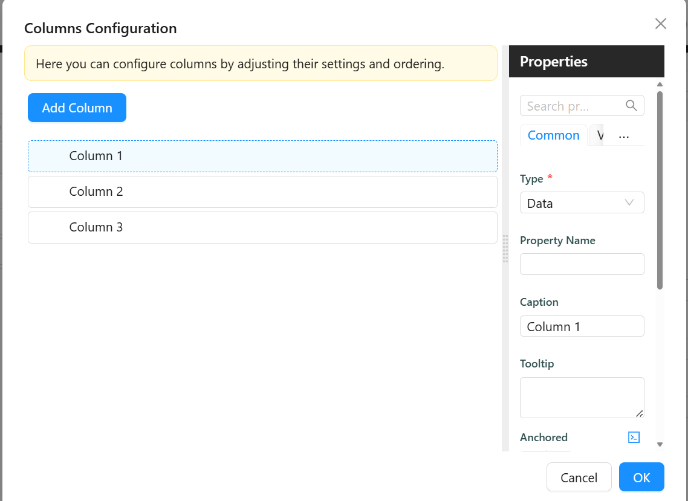

# DataTable

import LayoutBanners from './LayoutBanners';

The DataTable component is a versatile tool used to manage and configure the columns in a table, often within the context of a low-code or no-code platform. This component allows users to define, organize, and manipulate the structure and appearance of columns in a table-based display.

[//]: # (<iframe width="100%" height="500" src="https://pd-docs-adminportal-test.shesha.dev/shesha/forms-designer/?id=552accec-84dc-4841-962f-ff263b5ade73" title="Columns Component" ></iframe>)

## **Get Started**
*NB: This guide assumes the DataTable Context is already set up. [Learn how to configure it here.](../tables-lists/datatable-context.md#get-started)*
 
<LayoutBanners url="https://app.guideflow.com/embed/qkqw5zjf1k" type={1}/>
___

## Properties

The following properties are available to configure the behavior of the component from the form editor (this is in addition to [common properties](/docs/front-end-basics/form-components/common-component-properties)).

### Data
#### **Customize Columns** 

Configure columns using a visual builder. Optionally supports expression logic for visibility or customization.

- **Type** ``string`` – Defines the column type: 
    - Data *(default)*
    - Action 
    - CRUD operations 
    - Form
    
- **Property Name** ``string`` – The underlying field name from the data source.

- **Tooltip** ``string`` – Hover text shown in the column header.

- **Caption** ``string`` – Additional label or subtitle shown under the main title.

- **Anchored** ``object`` – Determines if the column is pinned during horizontal scroll:
    - Left

    - Right

- **Is Visible** ``boolean`` – Determines if the column should be displayed.

- **Display Component** ``string`` – Component used to render the value in view mode.

- **Edit Component** ``string`` – Component used when editing data inline.

- **Create Component** ``string`` – Component used for data entry in create forms.

#### **Show Expanded View** `boolean`  
Displays a detailed view of each row.

#### **Freeze Headers** `boolean`  
Keeps the header fixed during scroll.

#### **Use Multi-select** `boolean`  
Enables checkbox selection of multiple rows.

#### **Freeze Headers** `boolean`  
Pins table headers when scrolling.

#### **Can Edit Inline** `object`  
Controls inline edit behavior:
- **Yes**
- **No**
- **Inherit** *(default)*
- **Expression**

#### **Can Edit Inline Expression** `function`  
Conditionally enables inline editing.

#### **Row Edit Mode** `object` *(when Can Edit Inline is Yes/Expression)* 
- One By One *(default)*  
- All At Once

#### **Save Mode** `object` *(when Can Edit Inline is Yes/Expression)*
- Manual *(default)*  
- Auto

#### **Custom Update Url** `string` *(when Can Edit Inline is Yes/Expression)*

Endpoint to handle row updates.

#### **Can Add Inline** `object`  
Controls row creation:
- **Yes**
- **No**
- **Inherit** *(default)*
- **Expression**

#### **New Row Capture Position** `object` *(When Can Add Inline is Yes/Inherit)*
This controls where the new row entry field appears. Options include:
- Top *(default)*
- Bottom

#### **Custom Create URL** `string` *(When Can Add Inline is Yes/Inherit)*  
This specifies a custom endpoint where the new row data is posted.

#### **New Row Init** `function` *(When Can Add Inline is Yes/Inherit)*
Provides a JavaScript function to initialize a new row's default state. Great for pre-filling or conditional defaults.

#### **Can Add Inline Expression** `function` *(When Can Add Inline is Expression)* 
This function dynamically determines whether the user can add a new row.

#### **Can Delete Inline** `string`  
Controls delete access:
- **Yes**
- **No**
- **Inherit** *(default)*
- **Expression**

#### **Custom Delete URL** `string` *(When Can Delete Inline is Yes/Inherit)*
This specifies a custom endpoint to send delete requests to.

#### **Can Delete Inline Expression** `function` *(When Can Add Inline is Expression)*
Allows dynamic evaluation to determine if a row can be deleted inline. Perfect for permission-based deletion rules.
___

### Appearance

#### **Min Height** `number`  
Minimum height of the table container.

#### **Max Height** `number`  
Maximum height before vertical scroll appears.

#### **Table Container Style** `function`  
JS function returning CSS to apply on container.

#### **Table Style** `function`  
JS function returning CSS to apply on table.

#### **Empty State Icon** `object`  
Icon to show when there’s no data.

#### **Primary Text** `string`  
Main message shown when table is empty.

#### **Secondary Text** `string`  
Subtext shown in empty state.
