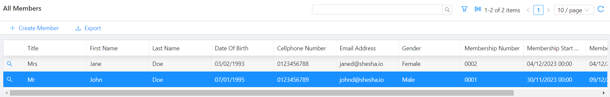
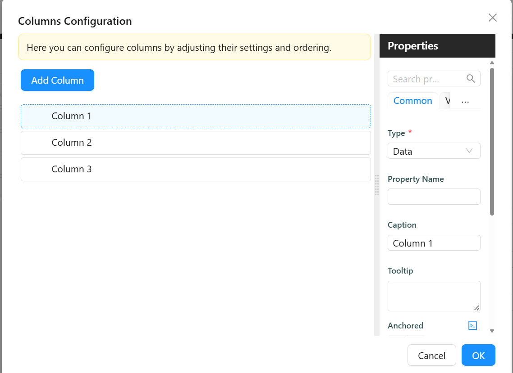

import LayoutBanners from './LayoutBanners';

# DataTable

A DataTable displays records from a data source in rows and columns. You configure which columns to show, how each column looks and behaves, and whether users can add, edit, or delete records directly inside the table. A DataTable reads its data from a parent DataTableContext component, which handles fetching, filtering, sorting, and paging so the DataTable only needs to focus on display.


*A DataTable showing a list of records with row selection enabled.*

## Get Started

:::info
This guide assumes a DataTableContext is already configured on your form. [Learn how to set one up here.](../tables-lists/datatable-context.md)
:::

<LayoutBanners url="https://app.guideflow.com/embed/qkqw5zjf1k" type={1}/>

---

## Properties

The following properties are available to configure the behavior of the component from the form editor (this is in addition to [common properties](/docs/front-end-basics/form-components/common-component-properties)).

---

### Columns

#### **Customize Columns**

Opens the column builder, where you define what the table shows. Each column maps to a field in your data source. You configure how the column header looks, how the cell renders in view mode, and what component appears when a row is being edited or created.


*The column builder in the form designer.*

Each column in the builder has the following settings:

**Type** - Determines what kind of column this is and which other settings appear for it.

| Option | When to use |
|---|---|
| `Data` | Show a field value from the record. This is the default for most columns. |
| `Action` | Show a button or link that triggers a configurable action when clicked. |
| `CRUD Operations` | Show a built-in set of edit, save, and delete icons for inline row editing. |
| `Form` | Embed a small form inside the cell using a separate form definition. |

**Property Name** - The field name from the data source this column reads its value from. Use dot notation for nested fields, for example `address.town`. Applies to `Data` and `Form` column types.

**Caption** - The text shown in the column header. If left blank, Shesha uses the property name.

**Tooltip** - Short text shown when the user hovers over the column header.

**Anchored** - Pins the column so it stays visible when the user scrolls horizontally. Choose `Left` to pin to the left edge or `Right` to pin to the right edge.

**Is Visible** - Controls whether the column is shown. Uncheck this to hide a column without removing it from the configuration.

**Display Component** - The component used to render the cell value in view mode.

**Edit Component** - The component used inside the cell when the row is being edited inline.

**Create Component** - The component used inside the cell when a new row is being created inline. If left blank, Shesha uses the Edit Component.

---

#### **Use Multi-Select** `boolean`

When enabled, a checkbox appears at the start of each row. Users can select multiple rows at once. Use this when you need to perform bulk actions on selected records.

---

#### **Freeze Headers** `boolean`

When enabled, the column headers stay fixed at the top of the table while the user scrolls down through a long list of rows.

---

### CRUD

The CRUD settings control whether users can add, edit, or delete records directly inside the table without opening a separate form.

#### **Can Edit Inline** `object`

Controls whether rows can be edited directly in the table.

| Option | Behaviour |
|---|---|
| `Yes` | Inline editing is always enabled. |
| `No` | Inline editing is always disabled. |
| `Inherit` | Inherits the setting from the parent DataTableContext. |
| `Expression` | Uses a JavaScript expression to decide at runtime. |

---

#### **Can Edit Inline Expression** `function`

Appears when Can Edit Inline is set to `Expression`. A JavaScript expression that returns `true` to enable inline editing or `false` to disable it.

Available variables:

| Variable | Type | Description |
|---|---|---|
| `formData` | `object` | Current values of all fields on the parent form. |
| `globalState` | `object` | The global application state. |
| `moment` | `object` | The Moment.js library for working with dates. |

**Form type to use:** Table / List View.

**Example - Disable editing when the record status is closed:**

```js
return formData.status !== 3;
```

---

#### **Row Edit Mode** `object`

Appears when Can Edit Inline is `Yes`, `Inherit`, or `Expression`. Controls how many rows can be in edit mode at the same time.

| Option | Behaviour |
|---|---|
| `One by one` | Only one row can be edited at a time. Clicking edit on another row discards any open changes. |
| `All at once` | All rows can be edited simultaneously. Use this for bulk editing scenarios. |

---

#### **Save Mode** `object`

Appears when Can Edit Inline is `Yes`, `Inherit`, or `Expression`. Controls when edited row data is saved.

| Option | Behaviour |
|---|---|
| `Auto` | Changes are saved automatically when the user moves focus away from the row. |
| `Manual` | The user must click the Save icon on the row to commit the change. |

---

#### **Custom Update URL** `string`

Appears when Can Edit Inline is `Yes`, `Inherit`, or `Expression`. An optional endpoint to override the default URL that row updates are posted to. Leave blank to use the standard entity update endpoint.

---

#### **Can Add Inline** `object`

Controls whether users can create new records by adding a row directly in the table.

| Option | Behaviour |
|---|---|
| `Yes` | Inline row creation is always enabled. |
| `No` | Inline row creation is always disabled. |
| `Inherit` | Inherits the setting from the parent DataTableContext. |
| `Expression` | Uses a JavaScript expression to decide at runtime. |

---

#### **Can Add Inline Expression** `function`

Appears when Can Add Inline is set to `Expression`. A JavaScript expression that returns `true` to allow row creation or `false` to prevent it.

Available variables: `formData`, `globalState`, `moment`.

---

#### **New Row Capture Position** `object`

Appears when Can Add Inline is `Yes`, `Inherit`, or `Expression`. Controls where the empty new-row input appears in the table.

| Option | Behaviour |
|---|---|
| `Top` | The new row input appears at the top of the table. |
| `Bottom` | The new row input appears at the bottom of the table. |

---

#### **Custom Create URL** `string`

Appears when Can Add Inline is `Yes`, `Inherit`, or `Expression`. An optional endpoint to override the default URL that new rows are posted to. Leave blank to use the standard entity create endpoint.

---

#### **New Row Init** `function`

Appears when Can Add Inline is `Yes`, `Inherit`, or `Expression`. A JavaScript function that runs when a new row is first added to the table. Use it to pre-fill default values on the empty row before the user starts typing. Return an object with the field values to pre-populate.

Available variables:

| Variable | Type | Description |
|---|---|---|
| `formData` | `object` | Current values of all fields on the parent form. |
| `globalState` | `object` | The global application state. |
| `http` | `object` | An Axios instance for making HTTP requests. |
| `moment` | `object` | The Moment.js library for working with dates. |

**Form type to use:** Table / List View.

**Example - Pre-fill the new row with the parent form's selected person:**

```js
return {
  personId: formData.personId,
  status: 1,
};
```

---

#### **On Row Save** `function`

Appears when Can Add Inline or Can Edit Inline is not `No`. A JavaScript function that runs when a row is about to be saved. Use it to validate or transform the row data before it is posted to the server. Your function must return the data object that should be saved.

Available variables:

| Variable | Type | Description |
|---|---|---|
| `data` | `object` | The current row field values. |
| `formData` | `object` | Current values of all fields on the parent form. |
| `globalState` | `object` | The global application state. |
| `http` | `object` | An Axios instance for making HTTP requests. |
| `moment` | `object` | The Moment.js library for working with dates. |

**Form type to use:** Table / List View.

**Example - Add a timestamp to the row before saving:**

```js
return {
  ...data,
  lastModifiedOn: moment().toISOString(),
};
```

:::warning
If On Row Save does not return a value, the row save will fail silently. Always return the full data object you want to save.
:::

---

#### **On Row Save Success** `action`

Fires after an inline row edit or creation has been saved successfully to the server. Use a configured action to show a confirmation message or refresh related data.

Available variables: `data`, `formData`, `globalState`, `http`, `moment`.

---

#### **Can Delete Inline** `object`

Controls whether users can delete rows directly from the table.

| Option | Behaviour |
|---|---|
| `Yes` | Inline row deletion is always enabled. |
| `No` | Inline row deletion is always disabled. |
| `Inherit` | Inherits the setting from the parent DataTableContext. |
| `Expression` | Uses a JavaScript expression to decide at runtime. |

---

#### **Custom Delete URL** `string`

Appears when Can Delete Inline is `Yes`, `Inherit`, or `Expression`. An optional endpoint to override the default URL used for row deletions. Leave blank to use the standard entity delete endpoint.

---

#### **On Row Delete Success** `action`

Fires after an inline row deletion has completed successfully. Use a configured action to show a confirmation message or update related data.

Available variables: `data`, `formData`, `globalState`, `http`, `moment`.

---

#### **Can Delete Inline Expression** `function`

Appears when Can Delete Inline is set to `Expression`. A JavaScript expression that returns `true` to allow deletion or `false` to prevent it.

Available variables: `formData`, `globalState`, `moment`.

**Form type to use:** Table / List View.

**Example - Only allow deleting rows that have not yet been approved:**

```js
return formData.approvalStatus !== 2;
```

---

### Layout

#### **Min Height** `number`

Sets a minimum height for the table container in pixels. The table will not shrink below this height even when it contains very few rows. Leave blank for a minimum height of zero.

---

#### **Max Height** `number`

Sets a maximum height for the table container in pixels. When the table content exceeds this height, a vertical scrollbar appears. Leave blank to let the table grow to fit all rows.

---

#### **Table Container Style** `function`

A JavaScript expression that returns a CSS style object applied to the outer wrapper around the table.

Available variables: `formData`, `globalState`.

**Example - Add a border and rounded corners to the table container:**

```js
return {
  border: '1px solid #d9d9d9',
  borderRadius: '8px',
  overflow: 'hidden',
};
```

---

#### **Table Style** `function`

A JavaScript expression that returns a CSS style object applied directly to the table element.

Available variables: `formData`, `globalState`.

---

### Empty Table

#### **Primary Text** `string`

The main message shown when the table has no rows to display. Defaults to `No Data`.

---

#### **Secondary Text** `string`

A supporting message shown below the primary text when the table is empty. Defaults to `No data is available for this table`.

---

#### **Icon** `object`

An icon displayed alongside the empty state message. Choose from the available icon set in the designer.

