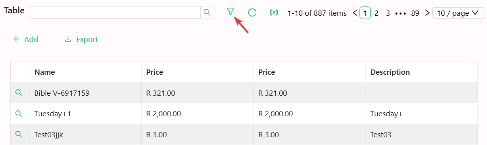

# Table Filter

The Table Filter component is a customizable filter button designed to help users quickly refine table data. It supports diverse configurations including layout, icons, tooltips, and custom action triggers—perfect for dynamic table filtering on dashboards or forms.

## Properties

The following properties are available to configure the behavior of the component from the form editor (this is in addition to [common properties](/docs/front-end-basics/form-components/common-component-properties)).

### Common

#### **Icon** `object`  
Name of an optional icon displayed on the button.

#### **Danger** `boolean`  
Adds a red style to indicate a destructive action.

#### **Block** `boolean`  
Expands the button to take up full width of its container.

#### **Action Configuration** `object`  
Defines the behavior triggered when the button is clicked.

___

### Appearance

#### **Button Type** `object`  
Controls the visual style:
- Primary
- Ghost
- Dashed
- Link
- Text
- Default *(default)*

