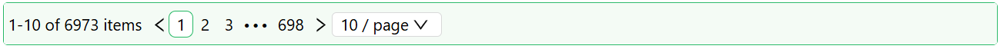

# Table Pager

The Table Pager component is a user interface element used in applications that display large sets of data in a tabular or paginated format. Its primary function is to break down the dataset into manageable sections or pages, enabling users to navigate through the data easily. This component should be used within a [Datatable Context Component](/docs/front-end-basics/form-components/tables-lists/datatable-context).

## Properties

The following properties are available to configure the behavior of the component from the form editor (this is in addition to [common properties](/docs/front-end-basics/form-components/common-component-properties)).

### Common
#### **Show Size Changer** `boolean`  
Toggles the page size selector dropdown. *(default: true)*

#### **Show Total Items** `boolean`  
Toggles the display of total item count. *(default: true)*

