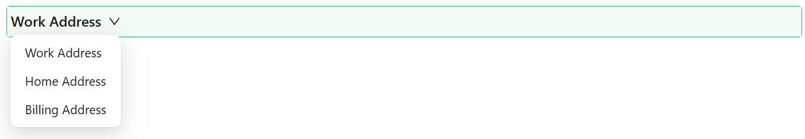

# Table View Selector

The Table View Selector is a user interface component commonly found in applications, particularly those dealing with tabular or list-based data. It allows users to switch between different predefined views or filters of the data presented in a table format. This component provides a list of configurable query builders that can be used to configure the different predefined filters and views. This component should be used within a [Datatable Context Component](/docs/front-end-basics/form-components/tables-lists/datatable-context).

_Implementation can be found [here](/docs/front-end-basics/how-to-guides/filtering)._

## Properties

The following properties are available to configure the behavior of the component from the form editor (this is in addition to [common properties](/docs/front-end-basics/form-components/common-component-properties)).

### Common

#### **Filters** `filtersList`  
Determines whether the search input is displayed as a block-level element.