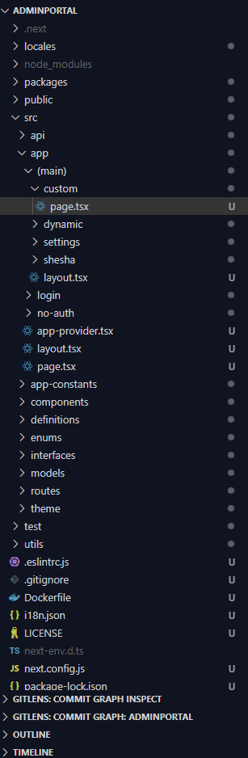
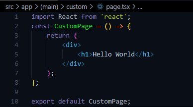
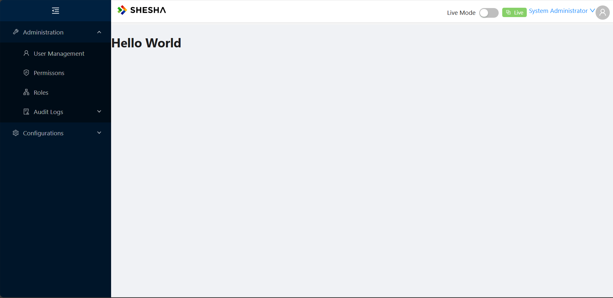

# Custom Pages

In as much as the power of Shesha is the ability to create application pages in a no-code manner, purely through configuration, there are times when you need to create a custom page. Custom pages allow you create a page using more traditional 'pro-code' based methods, namely as using React and TypeScript and are therefore unrestricted by the Shesha framework.

:::info Next.js
The Shesha front-end framework is based on the very popular and powerful [Next.js](https://nextjs.org/). The handling of custom pages is therefore all done by Next.js. If Next.js is not available in the packages, this feature will not work. Familiarity with Next.js is therefore also recommended.
:::

### Custom Pages vs Custom Components

To avoid confusion, there is a difference between custom pages and custom components. Custom pages integrate our own logic into the entire page, while custom components integrate our own logic into components that may be placed onto configured pages using the Shesha form designer.

## Implementation

To create a custom page:

1. Navigate to the **(main)** folder **(AdminPortal --> src --> app --> (main))**

2. Create a `custom` folder in the directory named after your desired URL path. For example, if you want the URL to include `/custom`, name the folder **custom**.

3. Once this folder has been created, it is suggested to create an `page.tsx` file inside the custom directory created. An illustration can be seen below (Figure 1: Folder Structure). A `.tsx` extension is used when embedding JSX elements inside the files, while `.ts` is used for plain TypeScript files that do not support adding JSX elements.

Figure 1 shows an illustration of the folder structure.



Figure 2 shows a snippet of code that will be added in the `page.tsx` page.



```ts
import React from 'react'

const CustomPage = () => {
    return (
        <div>
            <h1>Hello World</h1>
        </div>
    )
};

export default CustomPage
```

## How to Access

Adding a page to the Shesha boilerplate is the same as adding it to a Next.js application. If the developer is familiar with Next.js, it is the same with the Shesha boilerplate because the Shesha boilerplate uses Next.js to serve pages. This means that the Url will be suffixed by the created folder name. E.g. `https://shesha.io/custom` or `https://localhost:6006/custom`


