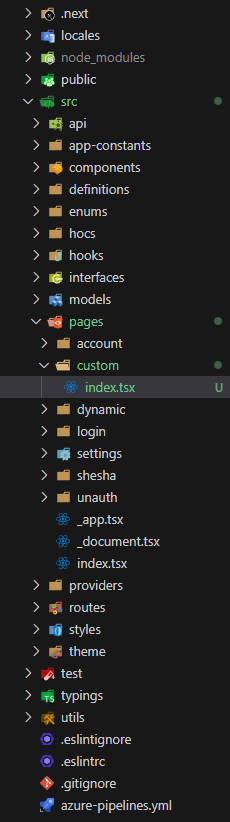
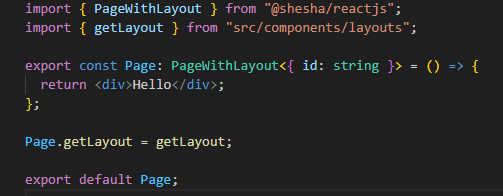
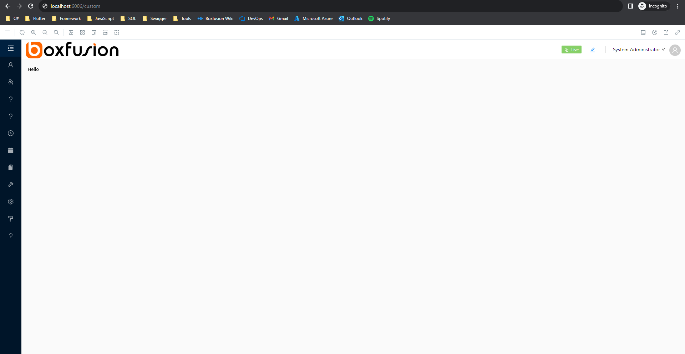

# Custom Pages

Custom pages are a way of integrating custom logic into a React application. A custom page is related to the Shesha framework front-end boilerplate. While the entire front-end framework is designed to work with drag-and-drop features, there are cases where creating a custom page becomes necessary.

### Custom Pages vs Custom Components

To avoid confusion, there is a difference between custom pages and custom components. Custom pages integrate our own logic into the entire page, while custom components integrate our own logic into the Shesha form designer.

## Implementation

To create a custom page:

1. Create a folder in the `pages` directory.

   - Navigate to the `src` folder and then to the `pages` folder (root -> src -> pages).
   - Create a folder with the name of the path you choose to use (e.g., a custom folder means `/custom` on the URL path).

2. Once this folder has been created, it is suggested to create an `index.tsx` file inside the custom directory created. An illustration can be seen below (Figure 1: Folder Structure). A `.tsx` extension is used when embedding JSX elements inside the files, while `.ts` is used for plain TypeScript files that do not support adding JSX elements.

> **Note:** This implementation is done by Next.js, and there is a direct dependency on Next.js. The handling of the pages and folder structure is all done by Next.js. If Next.js is not available in the packages, this feature would not work. Figure 2 shows a snippet of code that will be added in the `index.tsx` page. If a consistent layout is required, it can be set using `Page.getLayout` as seen in the illustration below.

## How to Access

Adding a page to the Shesha boilerplate is the same as adding it to a Next.js application. If the developer is familiar with Next.js, it is the same with the Shesha boilerplate because the Shesha boilerplate uses Next.js to serve pages. This means that your Url will be suffixed by your folder name. E.g. `https://shesha.io/custom` or `https://localhost:6006/custom`

