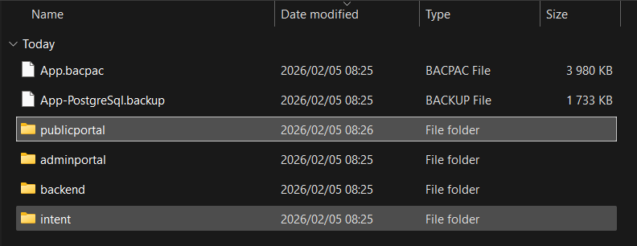
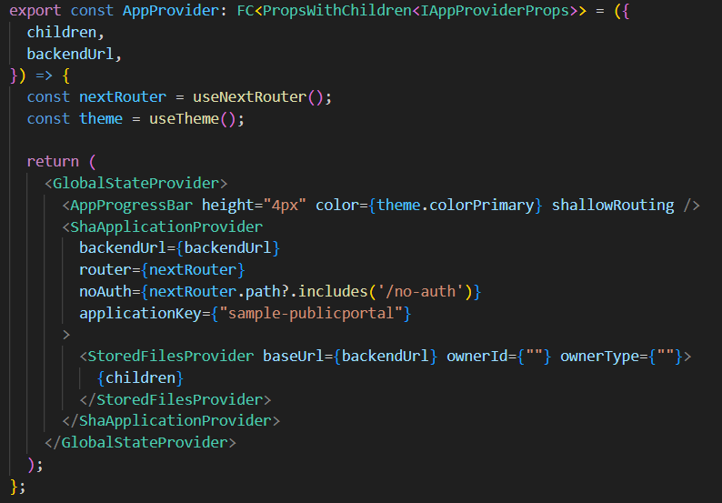
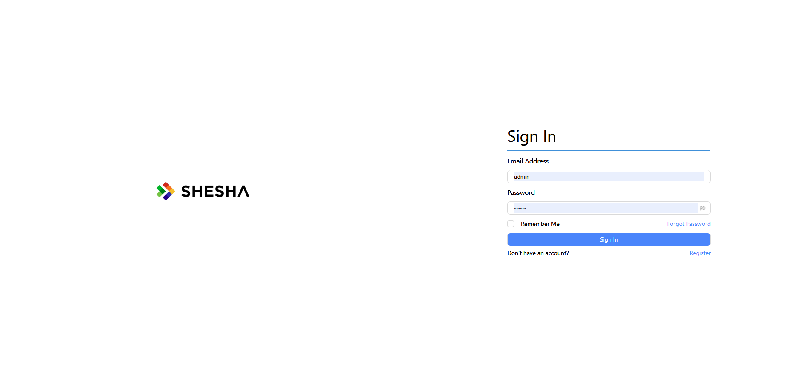

# Creating a New Front End Application in Shesha

This guide walks you through the process of creating a new front end application in your Shesha project.

## Table of Contents

- [Overview](#overview)
- [Step 1: Duplicate the AdminPortal Folder](#step-1-duplicate-the-adminportal-folder)
- [Step 2: Update Package Configuration](#step-2-update-package-configuration)
- [Step 3: Create Backend Migration for Application Key](#step-3-create-backend-migration-for-application-key)
- [Step 4: Update Application Provider Configuration](#step-4-update-application-provider-configuration)
- [Step 5: Install Dependencies and Test](#step-5-install-dependencies-and-test)

---

## Overview

Shesha allows you to create multiple frontend applications within a single project. Each frontend application can serve different purposes (e.g., public portal, customer portal, admin portal).

**Common use cases:**

- Creating a public-facing portal separate from the admin interface
- Setting up a customer/client portal
- Building specialized interfaces for different user roles

---

## Step 1: Duplicate the AdminPortal Folder

### 1.1 Copy the Folder

Navigate to your project root directory and duplicate the `adminportal` folder:

```bash
# In your project root directory
cp -r adminportal publicportal
```

Or use your file explorer to copy and paste the folder.



### 1.2 Verify the Folder Structure

After duplication, your project structure should look like this:

```
Sample.App/
├── adminportal/
├── publicportal/          ← New folder
├── backend/
├── intent/
└── docs/
```

> **💡 Tip:** Choose a meaningful name for your new application folder (e.g., `customerportal`, `publicportal`, `vendorportal`) that reflects its purpose.

---

## Step 2: Update Package Configuration

### 2.1 Update `package.json`

Open `publicportal/package.json` and update the name field:

**Before:**

```json
{
  "name": "@shesha-io/starter",
  "version": "0.0.1",
  "private": false,
  ...
}
```

**After:**

```json
{
  "name": "@shesha-io/sample-publicportal",
  "version": "0.0.1",
  "private": false,
  ...
}
```

### 2.2 Update Layout Configuration (Optional)

You can customize the layout settings for your new portal by editing the layout configuration file.

**Location:** `publicportal/src/app-constants/layout.ts`

This file contains constants that control your application's layout mode, header, login page, and footer. You can modify these existing constants to customize your portal:

**Available constants to update:**

```typescript
/** The layout mode to use throughout the application */
export const LAYOUT_MODE: LayoutMode = "defaultLayout";
// Options: 'defaultLayout' (sidebar) or 'horizontalLayout' (top navigation)

/** The header form to display in the layout */
export const ACTIVE_HEADER: FormFullName = HEADER_CONFIGURATION;
// Options: HEADER_CONFIGURATION (admin), HEADER_PUB_PORTAL_CONFIGURATION (public), or custom form

/** The login form to display on the login page */
export const ACTIVE_LOGIN: FormFullName = LOGIN_CONFIGURATION;
// Options: LOGIN_CONFIGURATION (admin), LOGIN_PUB_PORTAL_CONFIGURATION (public), or custom form

/** The footer form to display in the layout */
export const ACTIVE_FOOTER: FormFullName = null;
// Options: null (no footer), FOOTER_CONFIGURATION (standard), or custom form
```

> **💡 Available Shesha Form Configurations:**
>
> - `HEADER_CONFIGURATION` - Standard admin header
> - `HEADER_PUB_PORTAL_CONFIGURATION` - Public portal header
> - `LOGIN_CONFIGURATION` - Standard admin login
> - `LOGIN_PUB_PORTAL_CONFIGURATION` - Public portal login
> - `FOOTER_CONFIGURATION` - Standard footer

**Example customization:**

**Option 1: Use Shesha's built-in public portal forms**

Import the public portal configurations at the top of the file:

```typescript
import {
  LayoutMode,
  FormFullName,
  HEADER_PUB_PORTAL_CONFIGURATION,
  LOGIN_PUB_PORTAL_CONFIGURATION,
  FOOTER_CONFIGURATION,
} from "@shesha-io/reactjs";
```

Then update the constants:

```typescript
export const LAYOUT_MODE: LayoutMode = "horizontalLayout"; // Changed from 'defaultLayout'
export const ACTIVE_HEADER: FormFullName = HEADER_PUB_PORTAL_CONFIGURATION;
export const ACTIVE_LOGIN: FormFullName = LOGIN_PUB_PORTAL_CONFIGURATION;
export const ACTIVE_FOOTER: FormFullName = FOOTER_CONFIGURATION;
```

**Option 2: Use custom forms you created in the Forms Designer**

```typescript
export const ACTIVE_HEADER: FormFullName = {
  module: "Shesha",
  name: "custom-public-header",
};
export const ACTIVE_LOGIN: FormFullName = {
  module: "Shesha",
  name: "custom-public-login",
};
export const ACTIVE_FOOTER: FormFullName = {
  module: "Shesha",
  name: "custom-public-footer",
};
```

> **💡 Tip:** These settings are optional and only need to be changed if you want to customize the look and feel of your new portal to differentiate it from the admin portal.

> **⚠️ Note:** To use custom forms, create them in the Forms Designer first, then update these constants to reference your custom form using the format: `{module: 'YourModule', name: 'form-name'}`.

---

## Step 3: Create Backend Migration for Application Key

### 3.1 Understanding Application Keys

Each Shesha frontend application needs to be registered in the backend database with a unique application key. This key is used to:

- Identify the application in the system
- Associate forms and configurations with the specific frontend
- Manage permissions and access control

### 3.2 Create the Migration File

In the backend project, create a new migration file in the Migrations folder:

**Location:** `backend/src/Module/Sample.App.Domain/Migrations/`

**File naming convention:** `M[YYYYMMDDHHMMSSff].cs`

Example: `M20260205160000.cs`

### 3.3 Migration Template

Here's a complete migration template:

```csharp
using FluentMigrator;
using Shesha.FluentMigrator;

namespace Sample.App.Domain.Migrations
{
    [Migration(20260205085000)]
    public class M20260205085000 : OneWayMigration
    {
        /// <summary>
        /// Adds new Public Portal frontend application
        /// </summary>
        public override void Up()
        {
            Execute.Sql(@"
                IF NOT EXISTS (
                    SELECT 1
                    FROM [frwk].[front_end_apps]
                    WHERE [app_key] = 'sample-publicportal'
                )
                BEGIN
                    INSERT INTO [frwk].[front_end_apps]
                    (
                        [id],
                        [creation_time],
                        [creator_user_id],
                        [is_deleted],
                        [tenant_id],
                        [name],
                        [description],
                        [app_key]
                    )
                    VALUES
                    (
                        NEWID(),
                        GETDATE(),
                        NULL,
                        0,
                        NULL,
                        'Sample Public Portal',
                        'Sample public-facing portal application',
                        'sample-publicportal'
                    )
                END
            ");
        }
    }
}


```

### 3.4 Key Points About the Migration

1. **Migration Number:** Use a timestamp-based number (YYYYMMDDHHmmssff) to ensure unique migration ordering
2. **AppKey:** Use lowercase, no spaces (e.g., `sample-publicportal`, `customerportal`)
3. **GUID Generation:** The `NEWID()` function generates a unique identifier in SQL Server

### 3.5 Apply the Migration

After creating the migration file in `backend/src/Module/Sample.App.Domain/Migrations/`:

```bash
# Navigate to the backend directory
cd backend

# Build the solution
dotnet build

# Run the application - FluentMigrator migrations run automatically on startup
dotnet run --project src/Sample.App.Web.Host
```

> **⚠️ Important:** The migration will run automatically when the backend starts. Ensure your database connection string is correctly configured in `appsettings.json`.

---

## Step 4: Update Application Provider Configuration

### 4.1 **CRITICAL: Update the ShaApplicationProvider**

After creating the migration, you **MUST** update the application provider in your new portal to specify the application key. This is a required step!

**Location:** `publicportal/src/app/app-provider.tsx`

**Before:**

```typescript
export const AppProvider: FC<PropsWithChildren<IAppProviderProps>> = ({
  children,
  backendUrl,
}) => {
  const nextRouter = useNextRouter();
  const theme = useTheme();

  return (
    <GlobalStateProvider>
      <AppProgressBar height="4px" color={theme.colorPrimary} shallowRouting />
      <ShaApplicationProvider
        backendUrl={backendUrl}
        router={nextRouter}
        noAuth={nextRouter.path?.includes('/no-auth')}
      >
        <StoredFilesProvider baseUrl={backendUrl} ownerId={""} ownerType={""}>
          {children}
        </StoredFilesProvider>
      </ShaApplicationProvider>
    </GlobalStateProvider>
  );
};
```

**After:**

```typescript
export const AppProvider: FC<PropsWithChildren<IAppProviderProps>> = ({
  children,
  backendUrl,
}) => {
  const nextRouter = useNextRouter();
  const theme = useTheme();

  return (
    <GlobalStateProvider>
      <AppProgressBar height="4px" color={theme.colorPrimary} shallowRouting />
      <ShaApplicationProvider
        backendUrl={backendUrl}
        router={nextRouter}
        applicationKey={"sample-publicportal"}  // ⚠️ ADD THIS LINE
        noAuth={nextRouter.path?.includes('/no-auth')}
      >
        <StoredFilesProvider baseUrl={backendUrl} ownerId={""} ownerType={""}>
          {children}
        </StoredFilesProvider>
      </ShaApplicationProvider>
    </GlobalStateProvider>
  );
};
```

> **⚠️ CRITICAL:** The `applicationKey` property value **MUST** match the `app_key` value you used in the backend migration (e.g., `'sample-publicportal'`). Without this, the application will not be properly identified in the Shesha system.



## Step 5: Install Dependencies and Test

### 5.1 Clean and Install Dependencies

```bash
# Navigate to the new portal directory
cd publicportal

# Remove old node_modules and lock files (optional but recommended)
rm -rf node_modules package-lock.json .next

# Install dependencies
npm install
```

### 5.2 Run Development Server

```bash
npm run dev
```

### 5.3 Verify in Browser

Open your browser and navigate to `http://localhost:3000` (or `http://localhost:3001` if using a different port)

You should see your new Public Portal application running.



### 5.4 Verify Application Key Registration

To confirm the application key is properly registered:

1. Log into the backend database
2. Run this query:

```sql
SELECT * FROM frwk.front_end_apps WHERE app_key = 'sample-publicportal';
```

You should see a record with:

- app_key: `sample-publicportal`
- Name: `Sample Public Portal`
- Description: `Sample public-facing portal application`

> **💡 Tip:** If you don't see the record, ensure the migration ran successfully by checking the backend logs.

---

## Additional Resources

- [Shesha Documentation](https://docs.shesha.io)
- [Next.js Documentation](https://nextjs.org/docs)
- [FluentMigrator Documentation](https://fluentmigrator.github.io/)

---

## Summary

You've successfully created a new frontend application in your Shesha project by:

1. ✅ Duplicating the `adminportal` folder to `publicportal`
2. ✅ Updating configuration files (package.json, app constants)
3. ✅ Creating a FluentMigrator migration in `backend/src/Module/Sample.App.Domain/Migrations/` to register the application key
4. ✅ **Adding the `applicationKey` property to `ShaApplicationProvider` in `publicportal/src/app/app-provider.tsx`** (Critical step!)
5. ✅ Installing dependencies and testing the new application

Your new frontend is now ready for customization and development!

---

## Quick Reference Checklist

When creating a new frontend application named `[portalname]`:

- [ ] Duplicate `adminportal` → `[portalname]`
- [ ] Update `package.json` name field
- [ ] (Optional) Update `src/app-constants/layout.ts` to customize login form, header, footer, and layout
- [ ] Create migration file: `backend/src/Module/Sample.App.Domain/Migrations/M[timestamp].cs`
- [ ] Set AppKey in migration to `'[portalname]'` (lowercase, no spaces)
- [ ] **Update `src/app/app-provider.tsx` to add `applicationKey="[portalname]"` to ShaApplicationProvider**
- [ ] Run `npm install` in the new portal directory
- [ ] Start backend to apply migration
- [ ] Run `npm run dev` in the new portal
- [ ] Verify application in browser
- [ ] Verify database record exists in frwk_front_end_apps table

---

**Last Updated:** February 11, 2026
