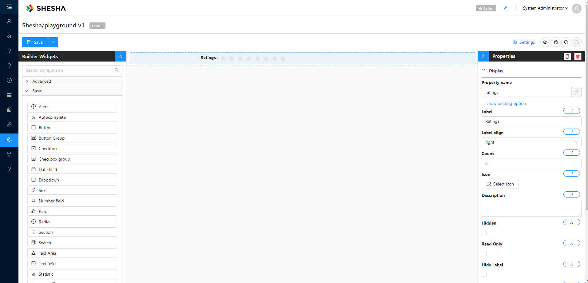
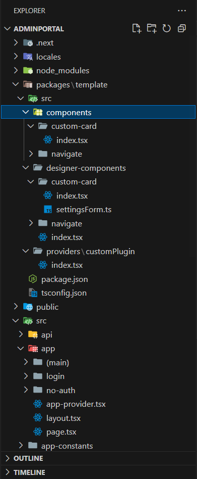
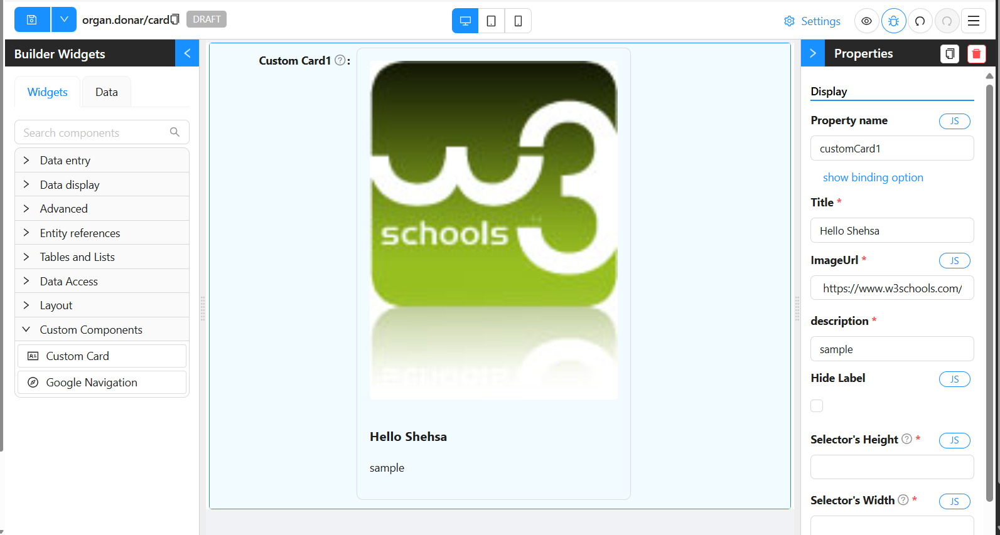
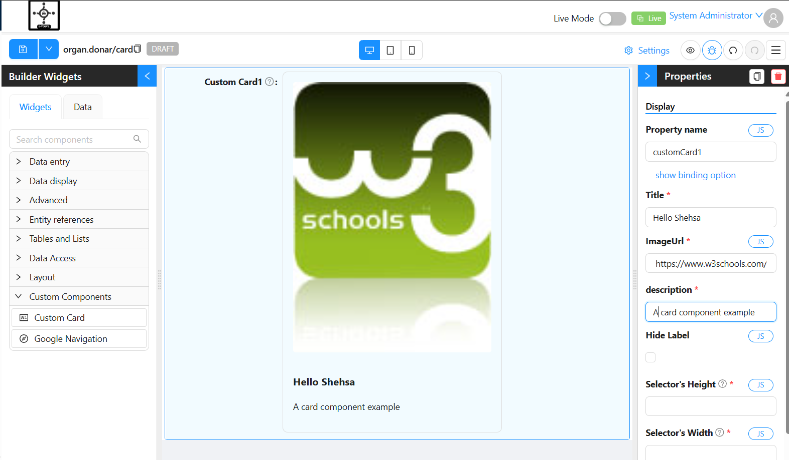
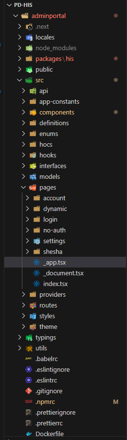

# Custom Components

## Overview

The Shesha Form Builder is a versatile tool offering a wide range of form components to cover most common scenarios. However, to meet unique requirements, Shesha allows the creation of custom components. These custom components can be seamlessly integrated into the Form Builder, enabling easy addition via a drag-and-drop interface.

## Background

Shesha Form Builder uses a JSON schema to assemble the form structure. Once the schema is available, it is injected into the builder, where it is interpreted to render components with their specific configurations.



#### Example JSON Schema

```ts
{
  "components": [
    {
      "id": "LAuoz8VcEzPdMTc5zFK-n",
      "type": "rate",
      "propertyName": "ratings",
      "componentName": "ratings",
      "label": "Ratings",
      "labelAlign": "right",
      "parentId": "root",
      "hidden": false,
      "isDynamic": false,
      "version": 1,
      "count": 8,
      "settingsValidationErrors": []
    }
  ],
  "formSettings": {
    "layout": "horizontal",
    "colon": true,
    "labelCol": {
      "span": 6
    },
    "wrapperCol": {
      "span": 18
    }
  }
}
```

> **NOTE**: The JSON schema above shows two properties: `components` (an array of form components) and `formSettings`. If there are multiple components in the UI form, they would appear as additional entries within the `components` array.

## Folder Structure

Shesha adopts a [monorepo](https://monorepo.tools) structure with [NPM workspaces](https://www.geeksforgeeks.org/getting-started-with-npm-workspaces), allowing shared dependencies between multiple projects or modules within a single application.

- The root workspace directory is typically named packages, where all relevant modules are stored.
- Within the src folder we need to add three new folders, the `components folder`, `designer-components` and `providers` folder

#### 📁 Components Folder

This folder contains the core implementation of the component.

- `src/components/custom-card/index.tsx`  
  Contains the standard `.tsx` file with the UI logic and necessary props for the `custom-card` component.

#### 📁 Designer Components Folder

This folder is responsible for integrating the component into the **Shesha Framework** and making it configurable for other developers.This is done succesfully by adding the designer component into an array of components  within the `src\designer-components\index.tsx`

- `src/designer-components/custom-card/index.tsx`  
  Wraps the core component and registers it with the Shesha design system, including metadata such as the component name and settings.

- `src/designer-components/custom-card/settingsForm.tsx`  
  Provides a configuration form that allows developers to customize the component’s behavior and appearance through a UI.

#### 📁 Providers Folder

- Components are exposed through the `index.tsx` file inside `\src\providers\custom-plugin`, which needs to be wrapped around the main application's provider.

  

#### Example Code: Exposing Components

```ts
import { useSheshaApplication } from "@shesha-io/reactjs";
import { Theecomponents } from "../../designer-components";
import React, { PropsWithChildren, useEffect } from "react";

export const REPORTING_PLUGIN_NAME = "Custom-Plugin";

export interface ICustomPluginProps {}

export const CustomPlugin: React.FC<PropsWithChildren<ICustomPluginProps>> = ({
  children,
}) => {
  const { registerFormDesignerComponents } = useSheshaApplication();

  useEffect(() => {
    registerFormDesignerComponents(REPORTING_PLUGIN_NAME, Theecomponents);
  }, []);

  return <>{children}</>;
};
```

#### Viewing Exposed Components

To view the list of exposed components in the Shesha Form Builder, open the `Custom Components` via the builder widgets, as shown in the image below:

  <!-- figure 7 -->



#### Data Structure

The `src\designer-components\index.tsx` file uses an array  to group components. This structure allows for organizing multiple component modules when needed.

The array is typed using the `IToolboxComponentGroup` interface, ensuring that the correct structure is followed. It is recommended to type `TheeComponents` as demonstrated in the example below:

#### Example Code: `TheeComponents`

```ts
import { IToolboxComponentGroup } from "@shesha-io/reactjs";
import CalendarComponent from "components/global/bookingCalendar/formComponent";
import FacilityContextPickerComponent from "components/global/facilityContextPicker/formComponent";
import StatsListComponent from "components/global/statsList/formComponent";
import TableFormComponent from "components/global/tableBuilder/formComponent";
import UrinalysisComponent from "components/global/urinalysis";
import SampleComponent from "components/global/urinalysis";

import { IToolboxComponentGroup } from "@shesha-io/reactjs";
import CustomCardComponent from "./custom-card";
import CustomNavigationComponent from "./navigate";

export const Theecomponents:IToolboxComponentGroup[]=[
    {
        name:"Custom Components",
        components:[CustomCardComponent,CustomNavigationComponent],
        visible:true
    }
]
```

> **NOTE**: An example of this folder structure can be found [here](https://github.com/shesha-io/shesha-framework/tree/main/shesha-starter/frontend-packages).

## Component Definition

In this example, we will demonstrate the standard way of creating a component in Next.js, including the use of typed props that extend the IConfigurableFormComponent interface from the Shesha Framework.
Note: This component will be handled by the Factory method within custom-card designer component.
#### Example Component: `CustomCard`
```ts 
import { IConfigurableFormComponent } from "@shesha-io/reactjs";
import React from "react";

export interface ICustomCard extends IConfigurableFormComponent {
  title: string;
  description: string;
  imageUrl?: string;
  footer?: React.ReactNode;
}

const CustomCard: React.FC<ICustomCard> = ({ title, description, imageUrl, footer }) => {
   
    return (
    <div style={{ border: "1px solid #ddd", borderRadius: 8, padding: 16, maxWidth: 350 }}>
      {imageUrl && (
        
      )}
      <h3>{title}</h3>
      <p>{description}</p>
      {footer && <div style={{ marginTop: 16 }}>{footer}</div>}
    </div>
  );
};

export default CustomCard;
```
## Desingner Component Definition

The custom-card component must implement the IToolboxComponent interface to maintain consistency within the Form Builder and this rule applies to all custom components. One more thing to point out is the Factory method, this is the method that will return our custom card JSX from components folder.

#### Example Component: `CustomCard`

```ts
import React from "react";
import CustomCard, { ICustomCard } from "../../components/custom-card";
import { settingsForm } from "./settingsForm";
import { IdcardOutlined } from "@ant-design/icons";
import {
  ComponentFactoryArguments,
  ConfigurableFormItem,
  IToolboxComponent,
  validateConfigurableComponentSettings,
} from "@shesha-io/reactjs";

const CustomCardComponent: IToolboxComponent<ICustomCard> = {
  type: "CustomCard",
  icon: <IdcardOutlined />,
  isInput: false,
  isOutput: true,
  name: "Custom Card",
  Factory: ({ model }: ComponentFactoryArguments<ICustomCard>) => {
    return (
      <ConfigurableFormItem model={model}>
        {(value, onchange) => (
          <CustomCard
            title={model.title}
            description={model.description}
            type={model.type}
            imageUrl={model.imageUrl}
            id={model.id}
          />
        )}
      </ConfigurableFormItem>
    );
  },
  initModel: (modal) => ({
    ...modal,
    title: "Hello Shehsa",
    description: "sample",
    imageUrl:
      "https://www.w3schools.com/images/w3schools_green.jpg",
  }),
  settingsFormMarkup: settingsForm,
  validateSettings: (model) =>
    validateConfigurableComponentSettings(settingsForm, model),
};

export default CustomCardComponent;

```

#### Key Properties of [IToolboxComponent](https://github.com/shesha-io/shesha-framework/blob/d4959da52f3285067f3269d7f9a14a0259281afb/shesha-reactjs/src/interfaces/formDesigner.ts):

- `Type`: Unique identifier for the component.
- `Name`: Displayed in the toolbox, often set as the default label.
- `Icon`: The icon shown in the toolbox.
- `Factory`: A method that returns a JSX element and defines how the component is rendered in the form.
- `Settings`: Used to configure form-specific settings like size, label visibility, etc.
- `initModel`: Initial values can be defined and will be applied during the form configuration initialization.

  <!-- figure 7 -->

  

## Form Configuration

- The `settingsForm` property defines the component's configuration, typically displayed in the side menu or metadata section of the builder.
- [`DesignerToolbarSettings`](https://github.com/shesha-io/shesha-framework/blob/d4959da52f3285067f3269d7f9a14a0259281afb/shesha-reactjs/src/interfaces/toolbarSettings.ts) is a helper class for building configurations. To create a configuration, simply add the appropriate method to the class and provide the necessary options. Then, import the configuration settings and inject them into the builder.

#### Example: `settingsForm` Configuration

```ts 
import { DesignerToolbarSettings } from '@shesha-io/reactjs';
import { nanoid } from 'nanoid';

export const settingsForm = new DesignerToolbarSettings()
    .addSectionSeparator({
        id: nanoid(),
        propertyName: 'separatorl',
        label: 'Display',
    })
    .addContextPropertyAutocomplete({
        id: nanoid(),
        propertyName: 'propertyName',
        label: 'Property name',
        validate: {
            required: true,
        },
    })
    .addPropertyAutocomplete({
        id: nanoid(),
        propertyName: 'title',
        label: 'Title',
         validate: {
            required: true,
        },
    },)
    .addTextField({
        id: nanoid(),
        propertyName: 'imageUrl',
        label: 'ImageUrl',
          validate: {
            required: true,
        },
    })
    .addPropertyAutocomplete({
        id: nanoid(),
        propertyName: 'description',
        label: 'description',
        validate: {
            required: true,
        },
    })
    .addCheckbox({
        id: nanoid(),
        propertyName: 'hideLabel',
        label: 'Hide Label',
    })
    .addNumberField({
        id: nanoid(),
        propertyName: 'height',
        description: 'This property determines the height of the selector in question.',
        label: "Selector's Height",
        validate: {
            required: true,
        },
    })
    .addNumberField({
        id: nanoid(),
        propertyName: 'width',
        description: 'This property determines the width of the selector in question.',
        label: "Selector's Width",
        validate: {
            required: true,
        },
    })
    .addCheckbox({
        id: nanoid(),
        propertyName: 'hasBorder',
        label: 'Has Border',
    })
    .toJson();
```
  <!-- figure 15 -->



## Factory Method

The `factory` property is a key method in the `IToolboxComponent` interface. It returns a JSX element and handles rendering in the form.

#### How Factory Works:

- The `factory` method takes a [`ComponentFactoryArguments`](https://github.com/shesha-io/shesha-framework/blob/d4959da52f3285067f3269d7f9a14a0259281afb/shesha-reactjs/src/interfaces/formDesigner.ts) object as an argument. The primary property of interest is `model`, which holds the component's configuration values.
- The `ConfigurableFormItem` component is responsible for managing the form's state, validation, visibility, and more.

> **NOTE**: It is important to note that [`ConfigurableFormItem`](https://github.com/shesha-io/shesha-framework/blob/d4959da52f3285067f3269d7f9a14a0259281afb/shesha-reactjs/src/components/formDesigner/components/formItem.tsx) is a form item and is responsible for handling state, validation, visibility and many more features on the Shesha Form Builder.

#### Example of Factory Method Usage:

```ts
const CustomCardComponent: IToolboxComponent<ICustomCard> = {
  type: "CustomCard",
  icon: <IdcardOutlined />,
  isInput: false,
  isOutput: true,
  name: "Custom Card",

  Factory: ({ model }: ComponentFactoryArguments<ICustomCard>) => {
    return (
      <ConfigurableFormItem model={model}>
        {(value, onChange) => (
          <CustomCard
            title={model.title}
            description={model.description}
            type={model.type}
            imageUrl={model.imageUrl}
            id={model.id}
          />
        )}
      </ConfigurableFormItem>
    );
  },

  initModel: (modal) => ({
    ...modal,
    title: "Hello Shehsa",
    description: "sample",
    imageUrl:
      "https://www.w3schools.com/images/w3schools_green.jpg",
  }),

  settingsFormMarkup: settingsForm,

  validateSettings: (model) =>
    validateConfigurableComponentSettings(settingsForm, model),
};

```

## Rendering the Factory Property

The factory property includes the `ConfigurableFormItem` component as its top-level parent. While using `ConfigurableFormItem` is not mandatory, it is the preferred approach. The children of `ConfigurableFormItem` receive a function with two parameters: `value` and `onChange`.

- `value`: Represents the current value of the active component.
- `onChange`: The event handler that triggers value changes.

The function that is the child of `ConfigurableFormItem` must return the component that will be rendered in the form builder. The component can either receive values directly or mute them, depending on the specification. In the provided example, the values from the model are directly passed to the components.

## Model

The model contains the component’s configuration values (e.g., title, size, border settings). The model is passed to the `ConfigurableFormItem`, and it reflects changes made via the form builder interface.

#### Example of Model Definition:

```ts
import { IConfigurableFormComponent } from "@shesha-io/reactjs";

export interface ICustomCard extends IConfigurableFormComponent {
  title: string;
  description: string;
  imageUrl?: string;
  footer?: React.ReactNode;
}

```

## Exposing Component

To expose custom components, wrap your application's root provider with the `Custom-Plugin`. This step makes the components available in the form builder.

Navigate to the `app-provider.tsx` file located in the `adminportal` directory: `src > app > app-provider.tsx`

  <!-- figure 11 -->



#### Example: Wrapping with `Custom-Plugin`

```ts
"use client";

import React, { FC, PropsWithChildren} from "react";
import {
  GlobalStateProvider,
  ShaApplicationProvider,
  StoredFilesProvider,
  useNextRouter,
} from "@shesha-io/reactjs";
import { AppProgressBar } from "next-nprogress-bar";
import { useTheme } from "antd-style";
import { CustomPlugin } from "../../packages/template/src/providers/customPlugin";

export interface IAppProviderProps {
  backendUrl: string;
}

export const AppProvider: FC<PropsWithChildren<IAppProviderProps>> = ({
  children,
  backendUrl,
}) => {
  const nextRouter = useNextRouter();
  const theme = useTheme();

  return (
    <GlobalStateProvider>
      <AppProgressBar height="4px" color={theme.colorPrimary} shallowRouting />
      <ShaApplicationProvider
        backendUrl={backendUrl}
        router={nextRouter}
        noAuth={nextRouter.path?.includes("/no-auth")}
      >
        <CustomPlugin>
          <StoredFilesProvider baseUrl={backendUrl} ownerId={""} ownerType={""}>
            {children}
          </StoredFilesProvider>
        </CustomPlugin>
      </ShaApplicationProvider>
    </GlobalStateProvider>
  );
};

```
