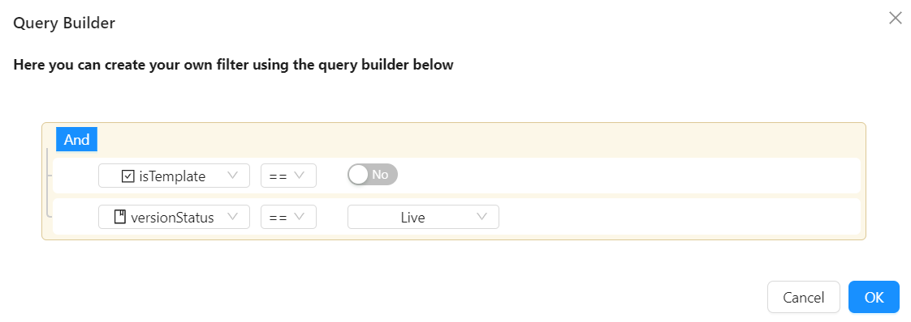
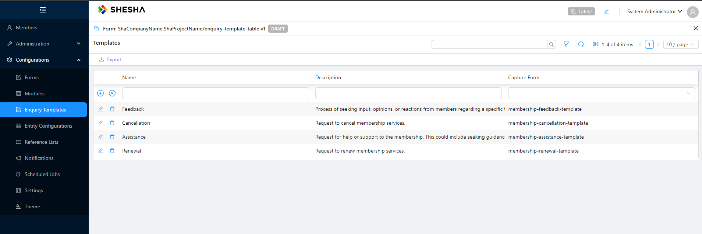
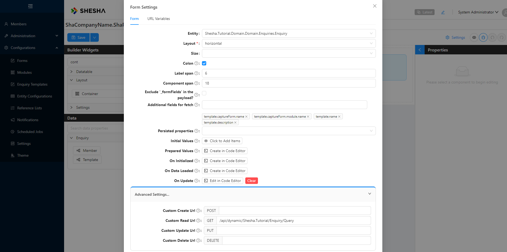
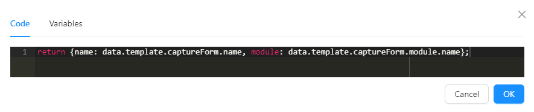

# Dynamic Form Pattern

Implementing the dynamic form feature to specify the form to be rendered within a sub-form using an expression offers several benefits:

- **Dynamic Form Selection:** Users can dynamically select the form to be displayed based on certain conditions or criteria. This flexibility allows for more customized and context-aware form rendering.
- **Improved User Experience:** By presenting users with relevant forms based on their context or input, the overall user experience is enhanced. Users only see the forms that are applicable to them at a given time, reducing clutter and confusion.
- **Increased Customization:** Users have greater control over form selection, enabling them to tailor the application to their specific needs and workflows. This promotes user empowerment and satisfaction.
- **Scalability:** As the application evolves and new forms are introduced, the expression-based form selection feature scales seamlessly. There's no need to modify existing components or workflows extensively to accommodate these changes.
- **Consistency:** By centralizing form selection logic within the sub-form component, consistency across the application is maintained. All forms are selected using a standardized approach, ensuring uniformity in user experience.
- **Potential for Automation:** Expression-based form selection opens up possibilities for automating form selection based on predefined rules or criteria. This can streamline processes and reduce the need for manual intervention.

Overall, implementing the feature to specify the form within a sub-form using an expression enhances flexibility, customization, and efficiency in form rendering, leading to an improved user experience and increased productivity.

## Use Cases

We have a membership management application, which allows the different members to be able to make enquiries about the membership. Examples could be:

- Providing Feedback
- Membership Renewal
- Membership Cancellation
- Membership Support or Assistance

Different data collection forms should be rendered for the different enquiry types. As new enquiry types are introduced into the system, this approach will allow users to seamlessly integrate their different enquiries without modifying the existing components or workflows.

### Template.cs

```csharp
using Abp.Domain.Entities.Auditing;
using Shesha.Web.FormsDesigner.Domain;
using System;

namespace Shesha.Tutorial.Domain.Domain.Enquiries
{
    /// <summary>
    /// This entity stores the different form templates to be rendered for each enquiry type
    /// </summary>
    public class Template: FullAuditedEntity<Guid>
    {
        public virtual FormConfiguration CaptureForm { get; set; }
        public virtual string Description { get; set; }
        public virtual string Name { get; set; }
    }
}

```

### Enquiry.cs

```csharp
using Abp.Domain.Entities.Auditing;
using Shesha.Domain;
using System;

namespace Shesha.Tutorial.Domain.Domain.Enquiries
{
    /// <summary>
    /// Stores the different enquiries made by members
    /// </summary>
    public class Enquiry: FullAuditedEntity<Guid>
    {
        public virtual Template Template { get; set; }
        public virtual Person Member { get; set; }
    }
}
```

### M20240313180500.cs

```csharp
using FluentMigrator;
using Shesha.FluentMigrator;
using System;

namespace Shesha.Tutorial.Domain.Migrations
{
    // <summary>
    ///
    /// </summary>

    [Migration(20240313180500)]
    public class M20240313180500 : Migration
    {
        /// <summary>
        /// Code to execute when executing the migrations
        /// </summary>
        public override void Up()
        {
            Create.Table("Tutorial_Templates")
                .WithIdAsGuid()
                .WithFullAuditColumns()
                .WithForeignKeyColumn("CaptureFormId", "Frwk_FormConfigurations").Nullable()
                .WithColumn("Description").AsString().Nullable()
                .WithColumn("Name").AsString().Nullable();

            Create.Table("Tutorial_Enquiries")
                .WithIdAsGuid()
                .WithFullAuditColumns()
                .WithForeignKeyColumn("MemberId", "Core_Persons").Nullable()
                .WithForeignKeyColumn("TemplateId", "Tutorial_Templates").Nullable();
        }
        /// <summary>
        /// Code to execute when rolling back the migration
        /// </summary>
        public override void Down()
        {
            throw new NotImplementedException();
        }
    }
}

```

## Creating Different Forms for Enquiry Types

In this example, we will create different forms for various enquiry types:

- **Membership Feedback Template**
- **Membership Cancellation Template**
- **Membership Renewal Template**
- **Membership Assistance Template**

### Enquiry Template Table Form

Create an 'enquiry-template-table' form that will be used to create the different enquiry types. Configure the form with the following settings:

- **Entity:** Shesha.Tutorial.Domain.Domain.Enquiries.Template
- **Template:** Table View
- **Name:** enquiry-template-table

Configure the datatable component with the following columns:

1. **CRUD Operations:**
   - Type: CRUD Operations
   - Label: _Leave empty_
2. **firstName:**
   - Type: Data
   - Label: First Name
   - Create Component: Text Field
   - Edit Component: Text Field
3. **lastName:**
   - Type: Data
   - Label: Last Name
   - Create Component: Text Field
   - Edit Component: Text Field
4. **captureForm:**

   - Type: Data
   - Label: Capture Form
   - Create Component: Autocomplete
   - Edit Component: Autocomplete

   Configure the Autocomplete 'Entity Filter' property with the following:
   

- Enable inline ‘add’, ‘edit’ and ‘delete’ functionality.
- Save your form, and you are ready to start creating enquiry templates.

### Adding Menu Item

Add an ‘Enquiry Templates’ menu item by following these steps:

1. Enable ‘Edit Mode’ and ‘Add New Item’ under the ‘Configurations’ group menu item.
2. Configure the menu item with the following settings:
   - **Title:** Enquiry Templates
   - **Icon:** FormOutlines
   - **Action:** `Common` > `Navigate`
     - **Navigation Type:** Form
     - **Form:** `enquiry-template-table`
3. Click ‘Save’ to confirm the new menu item addition and navigate to the newly created item.

### Creating Enquiry Templates

Create the following enquiry templates:



### Member Enquiry Form

Let's create a new form that will host the captured information for all the enquiries.

- **Name:** `member-enquiry`
- **Entity:** `Shesha.Tutorial.Domain.Domain.Enquiries.Enquiry`
- **Template:** Blank View
- Navigate to ‘Settings’ and configure the following ‘Additional fields to fetch’:
  - `template.name`
  - `template.description`
  - `template.captureForm.name`
  - `template.captureForm.module.name`
- Update the `Advanced Settings` Custom Read Url to `api/dynamic/Shesha.Tutorial/Enquiry/Query`



- Drag in an `alert` component and configure it with the following properties:
  - **Type:** Info
  - **Text:** Member Enquiry
  - **Description:** `{{template.name}} - {{template.description}}`
- Drag in a `sub form` component and configure it with the following properties:
  - **Hide label:** True
  - **Form Selection Mode:** Name
  - **Form:** JS > `return {name:data.template.captureForm.name,module:data.template.captureForm.module.name};`
    

### Create Dynamic Menu Items

Create [Dynamic Menu Items](/docs/front-end-basics/how-to-guides/dynamic-menu-items) that will list all available templates and assist in initializing the member `Enquiry` on the `member-details` view.


Once a template has been selected, the user will be redirected to the `member-enquiry` form which is initialized with a different form based on which template was selected:

**1. Renewal**


**2. Assistance**


**3. Cancellation**


**4. Feedback**


