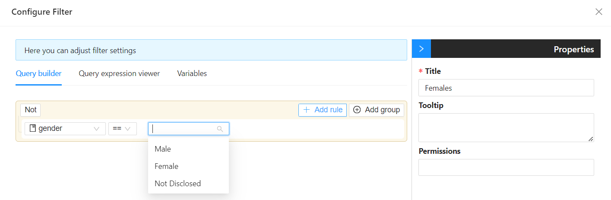
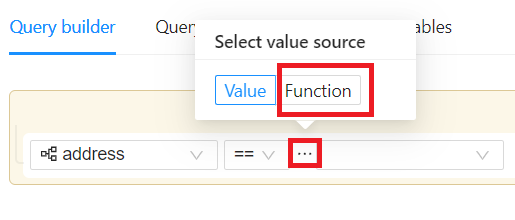
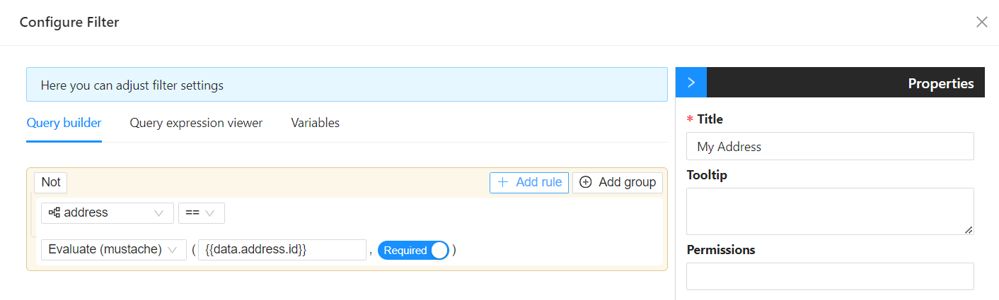

# Filtering

Filtering in an application refers to the process of narrowing down a set of data based on specific criteria, allowing users to focus on the information that is relevant to their needs.

There are several types of filtering that are supported through Shesha which can be accessed though a variety of components, namely:

1. [Table View Selector](/docs/front-end-basics/form-components/data-display/data-table/table-view-selector) (should be used within a [Datatable Context](/docs/front-end-basics/form-components/data-display/data-table/datatable-context))
2. [Entity Filter / Query Builder](/docs/front-end-basics/form-components/common-component-properties#entity-filter-query-builder)

## Filtering Using Static Values

Filtering with static values refers to the process of filtering and displaying data based on predefined, fixed criteria or values, rather than dynamically changing criteria based on user input or other variables. This static approach is often used when certain data subsets are known in advance and can be hardcoded or predefined in the application.

### How Filtering with Static Values Work:

- **Predefined Criteria:** Instead of allowing users to input criteria or parameters for filtering, the application uses predetermined or static values for filtering data.

- **Implementation in Code or Configuration:** The static values for filtering can be implemented directly in the code of the application or configured through settings. For example, in a database query, the WHERE clause might include static conditions like "status='active'" or "category='electronics.'"

### Use Cases:

- **Category Filters:** Displaying items belonging to specific categories, e.g., filtering products to show only those in the "Electronics" category.

- **Status Filters:** Showing data based on a specific status, such as "Open," "Closed," or "Pending."

- **Time-based Filters:** Displaying data from a predefined time range, like "Last 7 days" or "This month."

- **Hardcoding in UI Components:** In user interfaces, static values can be hardcoded into dropdown menus, buttons, or other UI components that users can interact with. Selecting an option triggers the predefined filter.

- **Enhancing User Experience:** While static filtering limits the flexibility compared to dynamic filtering, it can enhance user experience by providing quick access to commonly used views or subsets of data.

- **Maintenance:** When static filters are used, any changes or updates to the filtering criteria require modifying the application's code or configuration. This can be both an advantage (when the criteria are unlikely to change frequently) and a limitation (when flexibility is needed).

## Filtering with Dynamic Values

Filtering with dynamic values involves using criteria that can change based on user input or other variables. Mustache templating, often used in web development, is a logic-less template syntax that allows you to embed dynamic values into your markup. When combined with JavaScript and dynamic values, it becomes a powerful tool for creating templates that adapt to changing conditions, including dynamic filtering.

The query builder gives you access to the form data object that you can utilize for the filtering. Here's a simple example of dynamic filtering using Mustache templating:

- Select the `Evaluate(mustache)` function

