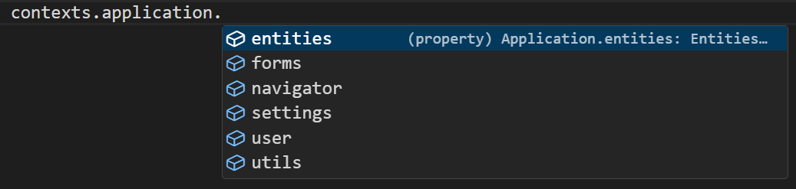

# Application API

The `application` object is available in every Shesha script and gives access to the core services of your application. Use it to work with the current user, navigate between pages, read application settings, and perform CRUD operations on entities - all without writing custom API endpoints.



---

## Sub-Objects

The `application` object is divided into focused sub-objects. Each one covers a specific area of the application.

| Sub-object | What it gives you |
|---|---|
| [`application.user`](/docs/front-end-basics/javascript-api/application/user) | Current user details and permission checks |
| [`application.navigator`](/docs/front-end-basics/javascript-api/application/navigator) | Navigate between pages and forms, or get a form's URL |
| [`application.entities`](/docs/front-end-basics/javascript-api/application/entities) | Create, read, update, and delete entities by module |
| [`application.settings`](/docs/front-end-basics/javascript-api/application/settings) | Read and write application settings by module |
| [`application.utils`](/docs/front-end-basics/javascript-api/application/utils) | Evaluate template strings against data |
| `application.forms` | Prepare form templates with dynamic replacements |

---

## application.forms

The `forms` sub-object lets you prepare dynamic form templates by substituting placeholders with runtime values.

**Form type to use:** Any form type - `application` is available everywhere standard script variables are.

**Example - Prepare a form template with a dynamic replacement:**

```javascript
const result = await application.forms.prepareTemplateAsync('my-template-id', { clientName: data.name });
```
