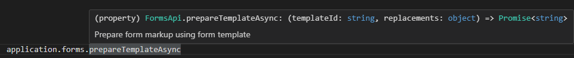

## application.forms

The **application.forms** object provides access to the forms API. This object gives access to a function that you can use to prepare form markup using form template.

> `application.forms.prepareFormAsync`
