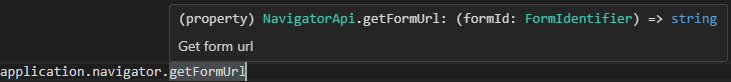
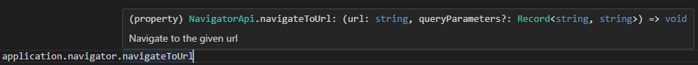

## application.navigator

The **application.navigator** object provides access to the navigator API. This object gives access to functions you can use to either navigate or read a form's url.

> Get form url: `application.navigator.getFormUrl`  
>   

> Navigate to a given form: `application.navigator.navigateToForm`  
>   

> Navigate to a given URL: `application.navigator.navigateToUrl`  
>   
