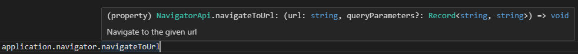
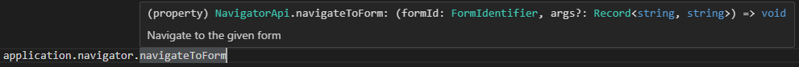
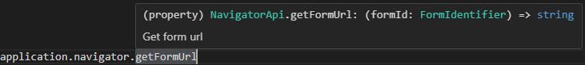

# Navigator

The `application.navigator` object lets you send the user to a different page or form from inside a script. Use it when an action on a form needs to redirect the user - for example, after creating a record, navigating to its details view, or sending the user to a related form with pre-filled query parameters.

:::info
The navigator is available in any Shesha script as `application.navigator`. It is the correct way to navigate programmatically. Do not use `navigateTo(...)` - that function does not exist in Shesha.
:::

---

## Methods

| Method | Returns | Description |
|---|---|---|
| `navigateToUrl(url, queryParameters?)` | `void` | Navigate to a full URL with optional query string parameters |
| `navigateToForm(formId, args?)` | `void` | Navigate to a Shesha form by its module and name |
| `getFormUrl(formId)` | `string` | Get the URL for a form without navigating to it |
| `prepareUrl(url)` | `string` | Apply Shesha URL conventions to a base URL |

---

## navigateToUrl

 Navigate to a given URL: `application.navigator.navigateToUrl`.
 
 Sends the user to any URL. Pass an optional object of query parameters to append to the URL.

 

**Form type to use:** Any form where an action should send the user to another page.

**Example - Navigate to an external URL:**

```javascript
application.navigator.navigateToUrl('https://www.example.com');
```

**Example - Navigate to a page and pass query parameters:**

```javascript
application.navigator.navigateToUrl('/app/invoices/details', { id: data.invoiceId });
```

---

## navigateToForm

 Navigate to a given form: `application.navigator.navigateToForm`  

 Sends the user to a Shesha form identified by its module and name. Pass an optional object of query parameters - for example, pass the record ID so the form can load the correct entity.

   

**Form type to use:** Any form where an action should open another configured form.

**Example - Navigate to a details form after creating a record:**

```javascript
application.navigator.navigateToForm(
  { module: 'MyApp', name: 'person-details' },
  { id: data.id }
);
```

**Example - Open a picker form without passing an ID:**

```javascript
application.navigator.navigateToForm({ module: 'MyApp', name: 'organisation-picker' });
```

---

## getFormUrl

 Get form url: `application.navigator.getFormUrl` 
 
 Returns the URL for a form as a string without navigating to it. Use this when you need the URL to store, display, or construct a link rather than to navigate immediately.

   

**Form type to use:** Any form where you need to build or display a link to another form.

**Example - Build a shareable link to a details view:**

```javascript
const url = application.navigator.getFormUrl({ module: 'MyApp', name: 'person-details' });
form.setFieldsValue({ shareableLink: `${url}?id=${data.id}` });
```

---

## prepareUrl

Applies Shesha URL conventions to a raw URL string. Use this when constructing a URL that needs to follow the application's base path rules before being used or displayed.

**Example - Prepare a base URL before navigating:**

```javascript
const fullUrl = application.navigator.prepareUrl('/app/custom-report');
application.navigator.navigateToUrl(fullUrl);
```
