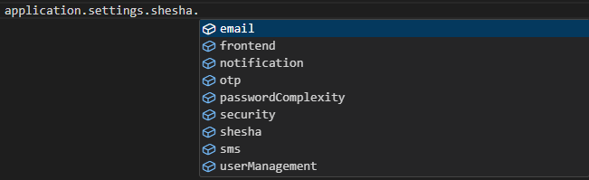

# Settings

The **application.settings** object allows to read and write values of application settings. Shesha uses modules to group different settings. Every application has a default module called `Shesha` that contains all the basic and essential settings.

Shesha Settings: `application.settings.shesha`  
  

You can use the `getValueAsync` and `setValueAsync` functions to read and write the values of the settings.

## `application.settings.email`  

This object contains the following settings accesssors that can be used to read and write email settings:  

```typescript
{
  emailSettings: {
	getValueAsync,
	setValueAsync
	},
  smtpSettings: {
	getValueAsync,
	setValueAsync
	}
}
```  

## `application.settings.frontend`  

This object contains the following settings accesssors that can be used to read and write frontend settings:  

```typescript
{
  theme: {
	getValueAsync,
	setValueAsync
	},
  mainMenu: {
	getValueAsync,
	setValueAsync
	},
  defaultUrl: {
	getValueAsync,
	setValueAsync
	},
  publicUrl: {
	getValueAsync,
	setValueAsync
	}
}
```

## `application.settings.shesha.otp`  

This object contains the following settings accesssors that can be used to read and write OTP settings:  

```typescript
{
  oneTimePins: {
	getValueAsync,
	setValueAsync
	}
}
```

## `application.settings.shesha.notification`  

This object contains the following settings accesssors that can be used to read and write notification settings:

```typescript
{
  notificationSettings: {
	getValueAsync,
	setValueAsync
	}
}
```

## `application.settings.shesha.security.passwordComplexity`  

This object contains the following settings accesssors that can be used to read and write password complexity settings:

```typescript
{
  requireDigit: {
	getValueAsync,
	setValueAsync
	},
  requireLowercase: {
	getValueAsync,
	setValueAsync
	},
  requireNonAlphanumeric: {
	getValueAsync,
	setValueAsync
	},
  requireUppercase: {
	getValueAsync,
	setValueAsync
	},
  requiredLength: {
	getValueAsync,
	setValueAsync
  }
}
```

## `application.settings.shesha.security`  

This object contains the following settings accesssors that can be used to read and write security settings:

```typescript
{
  userLockOutEnabled: {
    getValueAsync,
    setValueAsync
  },
  maxFailedAccessAttemptsBeforeLockout: {
    getValueAsync,
    setValueAsync
  },
  defaultAccountLockoutSeconds: {
    getValueAsync,
    setValueAsync
  },
  securitySettings: {
    getValueAsync,
    setValueAsync
  }
}
```

## `application.settings.shesha.shesha`  

This objects contains addional settings accesssors that can be used to read and write additional settings:

```typescript
{
  uploadFolder: {
    getValueAsync,
    setValueAsync
  }
}
```

## `application.settings.shesha.sms` 

This object contains the following settings accesssors that can be used to read and write SMS settings:

```typescript
{
  smsSettings: {
    getValueAsync,
    setValueAsync
  }
}
```

## `application.settings.shesha.userManagement`  

This object contains the following settings accesssors that can be used to read and write user management settings:

```typescript
{
  userManagementSettings: {
    getValueAsync,
    setValueAsync
  }
}
```

 application.settings.[module].[group].[setting]

Where module, group and setting are accessors (human readable code identifier of object). Logic of the accessors calculation:

1. Module: module alias with fallback to name in camelCase format. On the example below accessor of the module is **functionalTests**, but if you remove the **Alias** property it will be **boxfusionSheshaFunctionalTestsCommon**

```csharp
public class SheshaFunctionalTestsCommonModule : SheshaModule
{
    public override SheshaModuleInfo ModuleInfo => new SheshaModuleInfo("Boxfusion.SheshaFunctionalTests.Common")
    {
        FriendlyName = "Shesha Functional Tests Common",
        Publisher = "Boxfusion",
        Alias = "functionalTests"
    };

    /// ...
}
```

2. Group: alias of ISettingAccessors with fallback to interface name without `I` prefix and `Settings` suffix. On the example below accessor is **common**, but if you remove the AliasAttribute it will be **test**

```csharp
[Category("Tests")]
[Alias("common")]
public interface ITestSetting : ISettingAccessors
{
    [Display(Name = "UserLockout")]
    [Setting(TestSettingNames.UserLockout)]
    ISettingAccessor<int> UserLockoutItem { get; }

    [Display(Name = "Test Complex", Description = "Testing the complex setting item")]
    [Setting(TestSettingNames.TestComplex, EditorFormName = "complex-setting-test")]
    ISettingAccessor<TestComplexSetting> TestComplexSetting { get; }

    [Display(Name = "Stars Count")]
    [Setting(TestSettingNames.StarsCount)]
    ISettingAccessor<int> StarsCount { get; }
}
```

3. Setting: alias of the setting property with fallback to the property name in camelCase format.

```csharp
[Category("Tests")]
[Alias("common")]
public interface ITestSetting: ISettingAccessors
{
    [Display(Name = "UserLockout")]
    [Setting(TestSettingNames.UserLockOut)]
    ISettingAccessor<int> UserLockoutItem { get; }

    [Display(Name = "Test Complex", Description = "Testing the complex setting item")]
    [Setting(TestSettingNames.TestComplex, EditorFormName = "complex-setting-test")]
    ISettingAccessor<TestComplexSetting> TestComplexSetting { get; }

    [Display(Name = "Stars Count")]
    [Setting(TestSettingNames.StarsCount)]
    [Alias("stars")]
    ISettingAccessor<int> StarsCount { get; }
}
```

Example of settings usage:

```javascript
const evaluator = async () => {
    const settings = application.settings.functionalTests.common
    const starsCount = await settings.starsCount.getValueAsync();
};
```

**Note**: all settings of simple types are strongly typed, you can see it on the example above, the **starsCount** is declared as `ApplicationSettingAccessor<**number**>`

Read and write setting example:

```javascript
const evaluator = async () => {
    const settings = application.settings.functionalTests.common;
    const starsCount = await settings.starsCount.getValueAsync();
    
    const newStars = starsCount + 1;
    await settings.starsCount.setValueAsync(newStars);
};
```