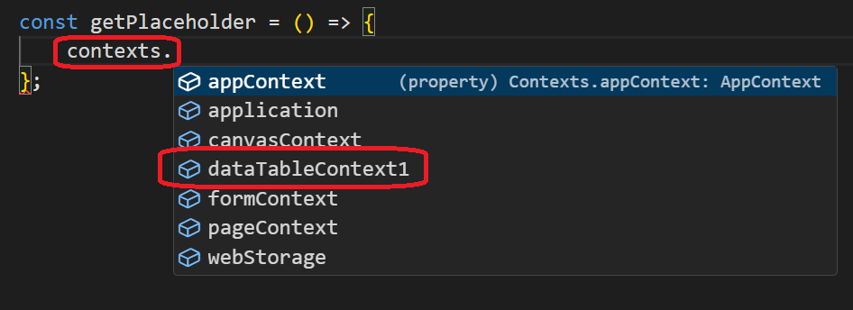
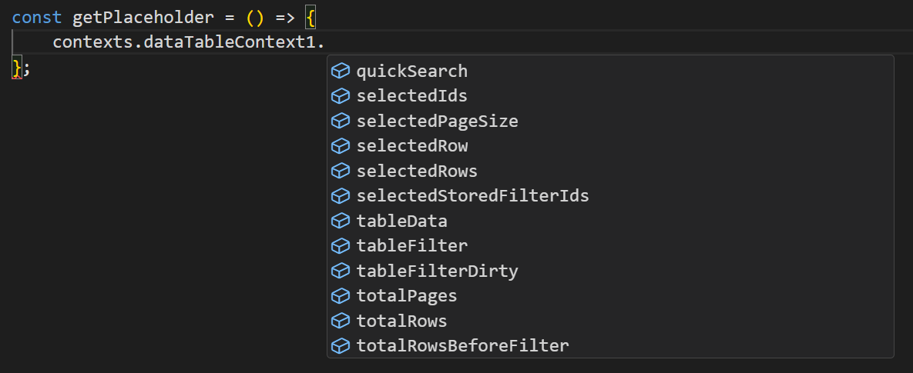
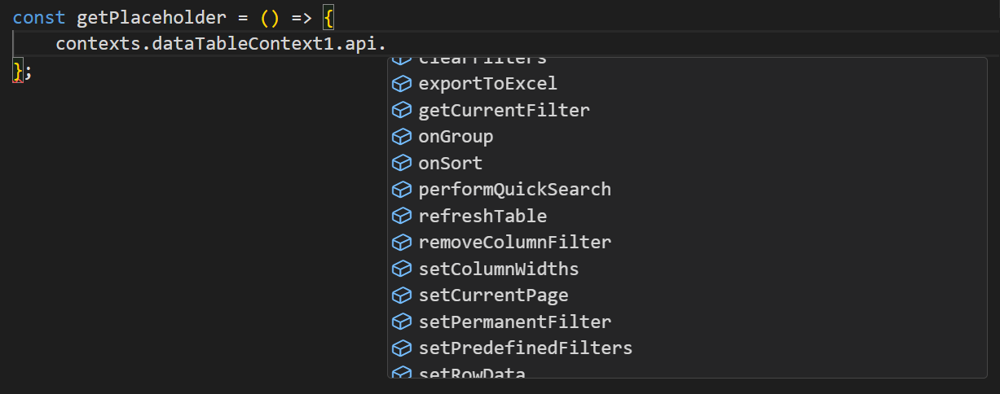

# Component Context

Some form components expose their own data, and in some cases an API of actions, as a named entry in the `contexts` object, alongside the standard contexts like `application` and `webStorage`. Not every component has one - check the context list in the script editor to see what's available for the components on your form.

---

## Finding a Component's Context

After you add a component that exposes a context to your form, it appears in the `contexts` list in the script editor's autocomplete, named after the component. For example, adding a **DataTable Context** component and a **DataTable** adds an entry for it to the list of contexts:

Different components expose different data and API shapes. For example, the fields exposed by a DataTable Context component:

and its exposed API:

Different components expose different data and API shapes - a Data Context component's fields and methods are not the same as another component's. Expand the component's entry in the autocomplete list to see exactly what it offers.

:::note
The **Data Context** component (`type: dataContext`) is the current implementation of what used to be called **DataTable Context** (`type: datatableContext`). Existing DataTable Context components are migrated automatically to Data Context, so an older form may still show the legacy name until that happens.
:::
