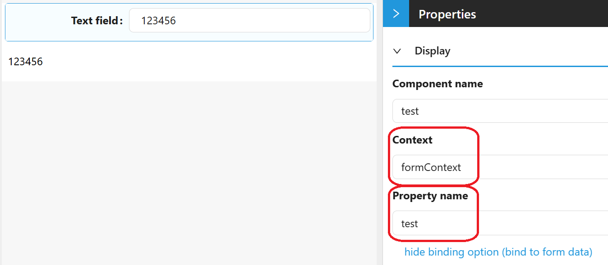
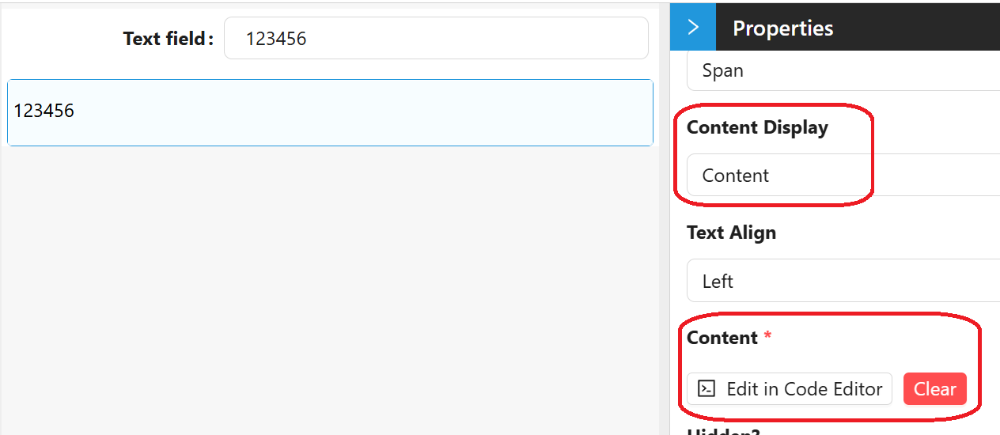
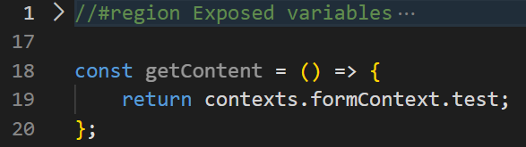
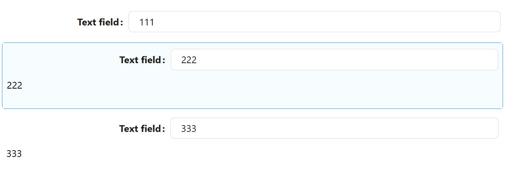

# Form Context

Form Context is a storage area scoped to a single form instance. Use it to hold temporary data that components on that form need to share with each other, without saving it to the form's own data or to the backend. When the form closes, its Form Context and everything stored in it are cleared.

---

## Accessing Form Context

`contexts.formContext` is available in any script on the form, alongside the other standard script variables.

It behaves like a plain object: there is no fixed list of properties, so any property you set on it becomes available under that name.

**Form type to use:** Edit Form - or any form type, since Form Context is available everywhere standard script variables are.

**Example - Setting a value:**

```javascript
contexts.formContext.myFormVariable = 'test data';
```

**Example - Reading a value:**

```javascript
const getPlaceholder = () => {
  return contexts.formContext.myFormVariable;
};
```

You can also bind a component directly to Form Context instead of writing to it from a script. Most Shesha form components use a Property Name control with a **show binding option** link next to it; clicking it reveals a **Context** selector. Choosing the context named `formContext` there, then a Property Name, makes that component read and write its value directly in `contexts.formContext.<propertyName>`.

---

## Form Context Is Per-Form

Exactly one App Context and one Page Context are always available across the whole application and the current page. Form Context is different: every form instance gets its own. If a main form embeds two SubForms, the main form has its own `formContext`, and each SubForm has its own separate `formContext` - the components on one SubForm cannot see the `formContext` values of the other, or of the main form.

---

## Example

Consider a form with a TextField and a Text component. The TextField's Property Name is bound to `formContext`, using the property name `test`.



The Text component's Content setting is scripted to read that same value back:





So the Text component shows whatever is typed into the TextField.

Now suppose that same form is reused as a SubForm. The main form has its own TextField, also bound to `formContext` using the property name `test`, and it embeds that SubForm twice. Every TextField on the page is bound to `formContext.test` - but because each SubForm instance has its own `formContext`, typing into one does not affect the others:


