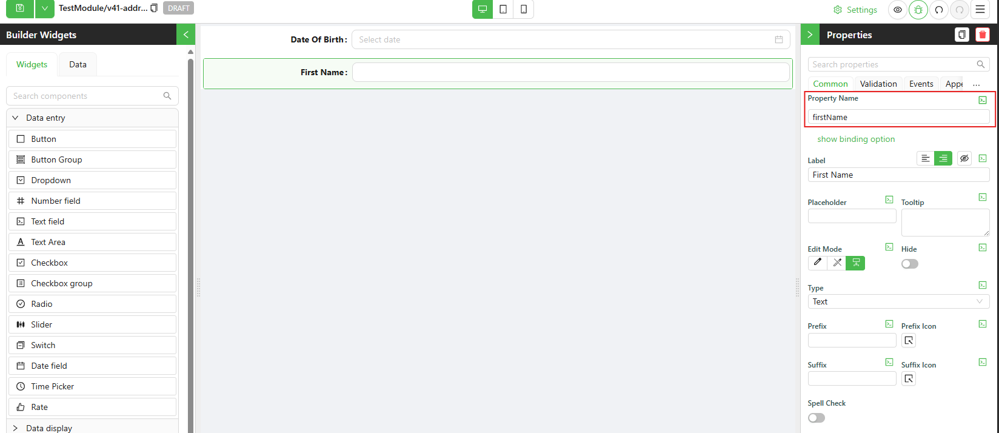

# Reading form data

We use `data` object to read the form values data. The properties of the `data` object depend on the form's contents and the `Property Name` of each of the components we have configured on the form.

For example, say we have configured a Date field with the name `dateOfBirth`.


When the user enters a value in the `dateOfBirth` field, the `data` object will have a property `dateOfBirth` with the value of the date.

When we want to access the value of the `dateOfBirth` field, we can use the `data.dateOfBirth` property.

```typescript
const dateOfBirth = data.dateOfBirth;
```

Another example is a Text field with the name `firstName`.



When the user enters a value in the `firstName` field, the `data` object will have a property `firstName` with the value of the text.

When we want to access the value of the `firstName` field, we can use the `data.firstName` property.

```typescript
const firstName = data.firstName;
```