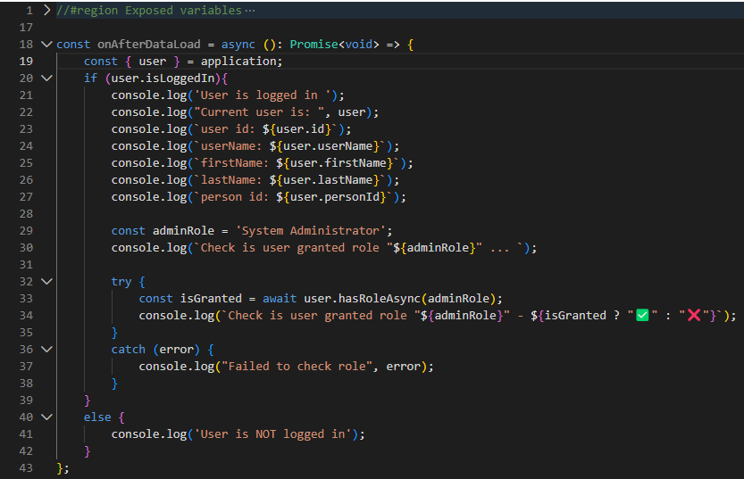
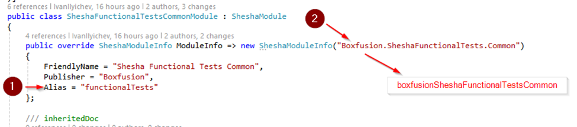
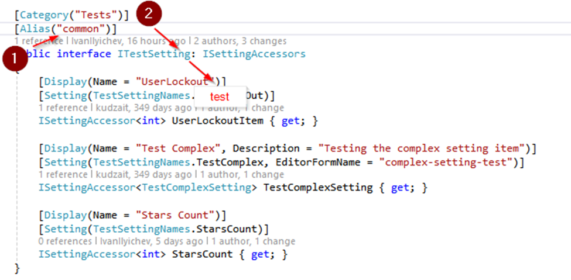
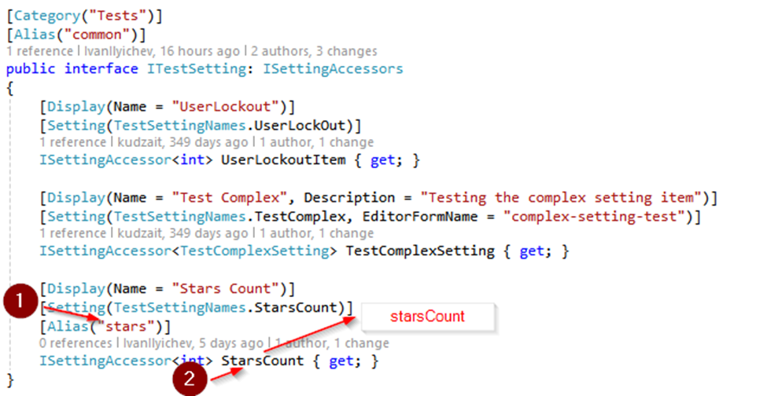
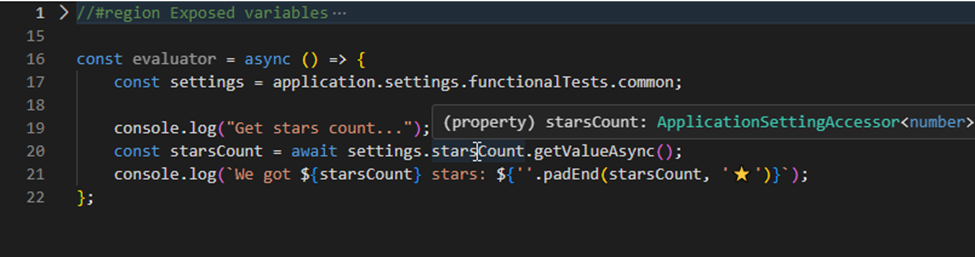
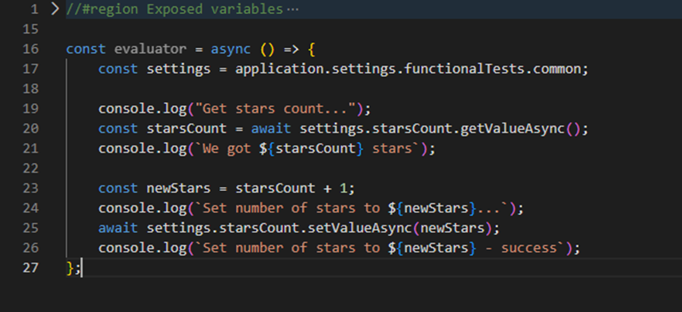

# JavaScript API

Shesha allows to interact with application using JavaScript API. This API can be used in any user-defined code on the form or form component level.
Central point of the JS API is the **'application'** exposed variable. It contains all standard Shesha objects (e.g. user, settings, entities etc)

## Top Level Availbale Objects and Functions  

- application 
- contexts
- data
- fileSaver
- form
- globalState
- http
- message
- moment
- pageContext
- selectedRow
- setGlobalState

## Current user API – application.user

Requirements for this API available on [GitHub (issue 819)](https://github.com/shesha-io/shesha-framework/issues/819). It’s an object that contains following properties:

1. isLoggerIn (`bool`) – is true of the user is currently logged in
2. id (`string`) – id of the current logged in user (Id of the User entity)
3. firstName (`string`) – first name of the current user
4. lastName (`string`) – last name of the current user
5. userName (`string`) – user name of the current user
6. hasPermissionAsync (`function(permission: string, permissionedEntity?: IEntityReferenceDto) => Promise<boolean>`) – asynchronous function that check is the current user granted a specified permission. It allows to provide Permissioned Entity reference (`id` and `_className`) to checking for permissions scoped by Permissioned Entity
7. hasRoleAsync (`function(role: string) => Promise<boolean>`) – asynchronous function that check is the current user appointer to a specified role
8. personId (`string`) - personId of the current user

Example of the usage:


## Settings API – application.settings

**application.settings** object allows to read and write values of application settings. Shesha uses the following format of the setting signature:

    application.settings.[module].[group].[setting]

Where module, group and setting are accessors (human readable code identifier of object). Logic of the accessors calculation:

1. Module: module alias with fallback to name in camelCase format. On the example below accessor of the module is **functionalTests**, but if you remove the **Alias** property it will be **boxfusionSheshaFunctionalTestsCommon**

   

2. Group: alias of ISettingAccessors with fallback to interface name without `I` prefix and `Settings` suffix. On the example below accessor is **common**, but if you remove the AliasAttribute it will be **test**

   

3. Setting: alias of the setting property with fallback to the property name in camelCase format.

   

Example of settings usage:

**Note**: all settings of simple types are strongly typed, you can see it on the example above, the **starsCount** is declared as `ApplicationSettingAccessor<**number**>`

Read and write setting example:


## Entities API – application.entities

**application.entities** provides basic operations on entities. Selection of the entity type is done using dot notation (the same approach as for application settings):

    application.entities.[module].[entityType]

Each entity type contain 4 basic CRUD methods:

**1. [createAsync](/docs/front-end-basics/javascript-api/entities-api/createAsync)** - create a new entity, see code example below:

**2. [getAsync](/docs/front-end-basics/javascript-api/entities-api/getAsync)** - fetch entity data from the back-end

**3. [updateAsync](/docs/front-end-basics/javascript-api/entities-api/updateAsync)** - update entity

**4. [deleteAsync](/docs/front-end-basics/javascript-api/entities-api/deleteAsync)** - delete entity

All listed operations use default CRUD API endpoints and don't require manual usage of urls.

## Shesha JavaScript API Plugins

Shesha allows developers to extend the application JS API using `useApplicationPlugin` hook. Example of usage provided below:

```typescript
import { useApplicationPlugin } from '@shesha-io/reactjs';

export const MyApplicationPlugin: FC<PropsWithChildren> = ({ children }) => {
    const [contextData] = useState<IMyPluginApi>(() => new MyPluginApi());

    useApplicationPlugin({
        // name of the plugin
        name: 'myPlugin',
        // plugin metadata
        buildMetadata: (builder) => {
            builder.addObject("myPlugin", "My Plugin API", m => ...);
        },
        // plugin data (api)
        data: contextData
    });

    return (<> {children} </> );
};
```
