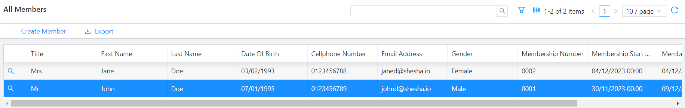

# SelectedRow

In the context of a datatable, a `SelectedRow` object typically refers to the representation of a row that has been selected by the user. `Datatables` are commonly used in web cccc to display tabular data, and allowing users to select one or more rows can be an essential feature for various interactions.

Here are some key points related to the concept of a `SelectedRow` object in the context of a datatable:

- **User Interaction**:
  Users interact with datatables by clicking on rows to select them. The `SelectedRow` object captures the information about the row that the user has selected.

- **Data Representation**:
  The `SelectedRow` object is a way to represent the data of the selected row. It may include the values of each column in the selected row or a reference to the underlying data associated with that row.

- **State Management**:
  Datatables often involve managing the state of the user interface. The `SelectedRow` object is part of the state that tracks which row or rows are currently selected. This information is crucial for performing actions such as editing, deleting, or processing the selected data.

## How to Access

Information about the `selectedRow` can be accessed within the `Contexts` that are available in the application and can be accessed like this (_assuming that the [datatable context](/docs/front-end-basics/form-components/tables-lists/datatable-context) component has a [property name](/docs/front-end-basics/form-components/common-component-properties#property-name) of `indexTable`_ ):

`contexts.indexTable.selectedRow`

## Example



In the example above, where the `datatable context` component has a property name of `indexTable`, the current state of the `index table`, which can be accessed through `contexts.indexTable`, would be:

```json
{
  "selectedRow": {
    "index": 1,
    "row": {
      "id": "d3c4c78f-c805-41c2-b4ba-cbb5a7663c0a",
      "title": 1,
      "firstName": "John",
      "lastName": "Doe",
      "dateOfBirth": "1995-01-07T00:00:00",
      "mobileNumber1": "0123456789",
      "emailAddress1": "johnd@shesha.io",
      "gender": 1,
      "membershipNumber": "0001",
      "membershipStartDate": "2023-11-30T00:00:00",
      "membershipEndDate": "2023-12-09T00:00:00",
      "membershipStatus": 2
    },
    "id": "d3c4c78f-c805-41c2-b4ba-cbb5a7663c0a"
  },
  "selectedIds": [],
  "currentPage": 1,
  "tableData": [
    {
      "id": "ffc1f0c9-5b9d-4a04-aed2-0d4cfe1152a9",
      "title": 2,
      "firstName": "Jane",
      "lastName": "Doe",
      "dateOfBirth": "1993-02-03T00:00:00",
      "mobileNumber1": "0123456788",
      "emailAddress1": "janed@shesha.io",
      "gender": 2,
      "membershipNumber": "0002",
      "membershipStartDate": "2023-12-04T00:00:00",
      "membershipEndDate": "2024-12-04T00:00:00",
      "membershipStatus": 2
    },
    {
      "id": "d3c4c78f-c805-41c2-b4ba-cbb5a7663c0a",
      "title": 1,
      "firstName": "John",
      "lastName": "Doe",
      "dateOfBirth": "1995-01-07T00:00:00",
      "mobileNumber1": "0123456789",
      "emailAddress1": "johnd@shesha.io",
      "gender": 1,
      "membershipNumber": "0001",
      "membershipStartDate": "2023-11-30T00:00:00",
      "membershipEndDate": "2023-12-09T00:00:00",
      "membershipStatus": 2
    }
  ],
  "userSorting": [],
  "grouping": [],
  "api": {}
}
```
